# 仙台问剑 · Xianxia Survivor

一个**纯前端、零素材、可离线双击运行**的 3D 修仙割草（Survivor-like）游戏。
目标形态：微信小游戏 / 抖音小游戏。

> **▶ 在线试玩：<https://muxili87-art.github.io/xianxia-survivor/>**
> （手机浏览器可直接打开，竖屏体验最好）

> 打开方式：直接双击 `index.html`。不需要 HTTP 服务器、不需要构建、不需要联网。

---

## 〇、打不开的话先看这里

如果页面停在「启动失败」面板上，**多半不是游戏的问题，是浏览器的 WebGL 没开**。
面板里已经写清了结论、探测结果和可操作的几步，照做即可。

一条实测过的经验，值得单独记下来：

> **同一个浏览器没有 WebGL，不代表这台机器没有。**
> 实测中遇到过一次：macOS 上的 Chrome 152 探测结果是
> `{"webgl2":false,"webgl1":false}` —— 一张普通画布都建不出上下文；
> 而**同一时刻、同一台机器**的 Safari 回报
> `{"webgl2":true,"renderer":"Apple GPU"}`，游戏完整跑完 10 秒、零报错。
>
> 结论：**换一个浏览器就能继续玩**。别把「我这台打不开」外推成「游戏有问题」。
>
> （背景：Chrome 152 已经移除了 WebGL 的软件渲染兜底 SwiftShader，
> GPU 一旦不可用就直接没有 WebGL，连降级路径都没有。）

---

## 一、这是什么

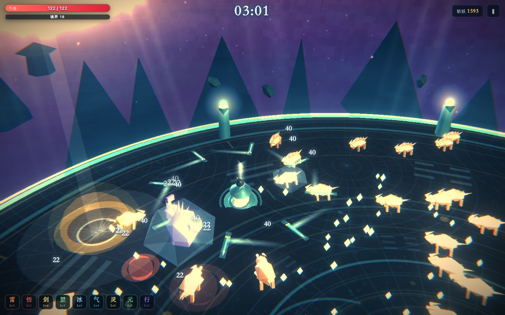

| 项 | 内容 |
|---|---|
| 玩法 | 3D 割草 / 幸存者（自动攻击 + 走位 + 三选一构筑） |
| 题材 | 修仙 —— 仙台法阵、妖魔、飞剑、天雷、玄冰、护体罡气 |
| 一局时长 | 8 分钟（480 秒），3 次魔尊、多次妖将 |
| 操作 | 虚拟摇杆 / WASD 移动；其余全自动；升级时三选一 |
| 技术栈 | 原生 JavaScript + Three.js r128（UMD）+ Canvas2D + Web Audio |
| 素材 | **0 字节外部素材**。所有贴图是 Canvas2D 画的，所有音效是振荡器合成的 |
| 体积 | 首包 ~850 KB（全部是代码） |

### 玩法循环

1. 站在仙台上，妖魔从台沿的刷怪环涌入；
2. 自动御剑 / 剑气 / 天雷 / 玄冰清场，捡灵石升级；
3. 每次升级三选一，10 种功法，构筑不同流派；
4. 150 / 300 / 420 秒魔尊降临，会「裂地」（有地面预警）；
5. 撑满 8 分钟 = 渡劫成功；死亡可看广告复活（限 2 次）。

### 十一种妖魔，十一种走位要求

割草游戏的深度不在「怪有多少血」，而在**玩家被迫做出多少种不同的移动决策**。
所以每个怪种都对应一个明确的行为要求：

| 妖魔 | 行为 | 玩家要做什么 |
|---|---|---|
| 小妖 / 妖蝠 / 力士 | 直线涌来 | 保持距离风筝 |
| 幽魂 | 快、脆、量大 | 靠范围伤害清 |
| **妖巫** | 停在 9.5 米外放法术弹 | **主动上前**清掉，或横向躲弹 |
| **妖狼** | 蓄力 0.72 秒后直线冲锋 | **横向闪避**（往后退是躲不掉的） |
| **裂魔** | 倒下后**裂成两只小裂魔** | **挑地方杀** —— 贴着脸清它，子体直接糊在身上 |
| **小裂魔** | 裂魔的残片，弱但成群 | 靠范围伤害顺手扫掉；不会再分裂 |
| **盾卫** | 撑起 5.5 米护罩，**范围内友军减伤 30%** | **先杀它** —— 不先杀，这一整片都打不动 |
| 妖将 | 高血、慢、带巨刃 | 集火，别被围住 |
| 魔尊 | 两套招式**严格交替**：红环扩散的「裂地」/ 蓝环收拢的「弹幕环」（血量低于 65% 后解锁） | 裂地要**离开原地**，弹幕环要**横向闪避** —— 两招的反向运动本身就是提示 |

新加的三个怪都是「**决策型**」而不是「数值型」的：
裂魔让「在哪杀」变成一个选择，盾卫让「先杀谁」变成一个选择，
魔尊的第二套招式让「拉开距离」不再万能。

设计上有两条刻意为之的约束：

- **护罩减伤取最大值，不叠加。** 叠加会让「又多刷了一只盾卫」
  变成一堵没法解释的乘法墙；取最大值则永远只值 30%，玩家能算得清。
- **两个招式交替而不是随机。** 交替是可学的（玩家会在预警期间预先走位），
  随机则两个招式都退化成噪音。

### 元素状态：让「构筑」看得见

冰缓与灼烧不只是数字，它们会在妖魔身上**套一层发光的晶体外壳**（冰=棱角晶体、火=向上火舌），
并改变妖魔自身的色调。同一屏里一眼就能数出「我这套 build 控住了几只」——
没有这层外壳，密集战斗里玩家根本感知不到自己叠了什么。

> **两种外壳是两套几何，不是同一个模型的两种颜色。** 只靠青 / 橙区分，
> 对红绿色盲玩家等于没区分，而这两个状态在玩法上完全相反（减速 vs 掉血）。
> 详见技术要点「无障碍：形状优先于颜色」。

天雷劈击后会在地上**留下一片雷电场**，持续 2 秒跳伤 —— 于是「把怪往电场里引」
成了一个真实的操作，天雷不再只是「每隔几秒闪一下」。

### 功法进化：从「数值堆叠」到「有目标感」

只有「+1 级」的升级池，玩家每局做的事都是同质的：见到御剑术点御剑术。
这叫数值堆叠，不叫构筑 —— 三分钟之后玩家就没有任何**目标**了。

进化给的是目标：**基础功法点满 + 前置功法达标**，下一次升级的三选一里
**必定**出现一张金色进化卡（固定占第一格，不参与权重抽卡）。于是
「这局我要不要为了它去点一个平时不会点的暴击」变成了真决策。

| 基础功法（满级） | 前置 | 进化 | 质变点（有效 DPS 倍率） |
|---|---|---|---|
| 御剑术 Lv6 | 太上忘情 Lv2 | **万剑归宗** | 剑数 8 → 11、威力 ×1.25、转速 ×1.10、22% 回旋补斩 —— **×2.10** |
| 剑气纵横 Lv5 | 聚灵阵 Lv2 | **剑破虚空** | 数量 5 → 7、威力 ×1.30、**贯穿无上限** —— **×2.07** |
| 天雷诀 Lv5 | 玄冰诀 Lv2 | **九天雷罚** | 落雷 5 → 7、威力 ×1.35、范围 ×1.4 —— **×2.05** |
| 烈焰符 Lv4 | 护体罡气 Lv2 | **焚天业火** | **必定点燃**、灼烧 ×1.4、被烧死的妖魔**把火传给附近 3 只** |
| 玄冰诀 Lv4 | 缩地成寸 Lv2 | **玄冰绝域** | 冰域 ×1.3、减速加深、**被冰封者受到的伤害 +15%** |
| 护体罡气 Lv5 | 混元一气 Lv3 | **太清罡煞** | 罡气 ×1.4、范围 ×1.3、减伤上限 30% → 40% |

> **进化倍率为什么定在 ×2 左右**：一开始给到 ×2.5~3.3，实测 16 局胜率
> 从 19% 直接顶到 **87.5%** —— 因为终局难度本质是个阈值
> （「能不能压住刷怪速度」），DPS 过线就全线通关，是阶跃而不是渐变。
> 收到 ×2 之后进化依然是「这局我成了」的高光，但不再是一键通关。

> **上限等级为什么被压到 4~6 级**：一局只给 ~24 次三选一。
> 原本御剑术满级 8 级 + 前置 3 级 = 11 次，占掉半套 build，
> 实测 16 局只有 12.5% 能达成进化 —— 也就是 87.5% 的玩家整局都看不到
> 自己追的目标。压缩上限后达成率进入健康区间。
>
> ⚠️ **压缩上限不等于曲线不变**：即使保持满级值一致，中间每一级也会变强
> （前段被抬升），实测这一项单独就把胜率从 19% 顶到 87%。
> 所以压缩上限后必须**把满级值也相应下调**（这里是约 10%），
> 或者接受"玩家少 2 级成长空间、省下的点数投到别处"这笔交换。
> 改完一定要用脚本把每个技能的满级数值打出来核对，不能靠眼睛看。

设计上有三条硬约束：

1. **进化必须在「一眼可见」的层面体现**。只涨数字玩家是感觉不到的 ——
   所以飞剑变大、剑气变粗、雷电场变大、妖魔身上的火壳变亮。
2. **进化的数值一律写在 `config.js` 各功法的 `apply()` 里**，按 `p.evolved[id]`
   分支计算。这样「基础成长曲线」和「进化加成」共用一个真相来源，
   不会两处走样。`apply()` 必须是**绝对赋值**，因为它会被全量重算调用。
3. **`apply(p, lv, re)` 的第三个参数是「重算」标记**。进化后要把所有已学功法
   重跑一遍，此时必须跳过「升级时回血」这类一次性副作用 ——
   否则进化一次白送一口血，而且以后每加一次技能都在送。

打点里加了 `evolves` / `evolveRate` / `evolvePref`：如果所有对局的 `evolves`
都是空的，说明触发条件定得没人能碰到，那进化就只是个「写了没用」的系统。

---

### 局外成长：让「再来一局」有理由

单局内的成长只解决「这一局怎么打」。一局结束一切归零，玩家第二次打开游戏的动机就是零。
所以补上了跨局的三本账 —— **灵石商店 / 成就 / 图鉴**，统一收在开始界面的「山门」里。

**灵石商店**（六条永久强化轨道，价格按 1.55 倍递增）

| 轨道 | 效果 | 上限 | 首级价 | 满级累计 |
|---|---|---|---|---|
| 淬体 | 初始气血 +10 | 6 | 680 | 15 890 |
| 剑意 | 全局伤害 +2% | 6 | 780 | 18 240 |
| 疾风 | 初始移速 +1% | 4 | 590 | 5 120 |
| 聚宝 | 灵石获取 +6% | 5 | 360 | 5 200 |
| 悟性 | 经验获取 +3% | 4 | 530 | 4 590 |
| 灵韵 | 灵气拾取范围 +8% | 5 | 620 | 8 960 |

一局结算约 4000~5000 灵石（斩妖 1/只 + 妖将 20 + 魔尊 300），
全部点满 58 000 ≈ 13 局。**退出对局不入账** —— 否则「开局立刻退出」会变成刷灵石的最优解。

三条设计红线：

1. **只加下限，不改手感。** 加气血、加伤害、加移速；绝不改攻击节奏、技能形态、波次表。
   那些是玩家学到的「规则」，改规则会让人重新学一遍，而不是感觉变强。
2. **数值可预期。** 每级写死 +10 气血 / +2% 伤害，没有随机、没有「概率触发」——
   否则玩家算不清自己买到了什么。
3. **一部分轨道不参与战斗**（聚宝、灵韵）。它们提供「再来一局」的动力，
   却不会推高战斗力的天花板 —— 这是控制局外成长风险最省事的一招。

**成就**（16 条，铜/银/金/紫四档）全部奖励「玩得更狠」，不奖励「玩得更怪」——
境界更高、斩妖更多、进化更多、不复活通关。没有「不许点某个功法」这类反直觉约束：
小游戏没有攻略社区，玩家读不懂的成就等于不存在。

**图鉴**（24 条 = 8 妖魔 + 10 功法 + 6 进化）的数值**全部从 `config.js` 派生**，不另写一份。
另写一份的下场是「图鉴写着小妖 13 血、实际打起来 20 血」，而这种不一致玩家一定会发现。
解锁时机：妖魔首次刷新 / 功法首次习得 / 进化首次达成。

> **为什么三块塞进一个面板**：小游戏的「元界面」越少越好。玩家点「山门」时心里想的是
> 「我要变强」，具体是买强化、看成就还是翻图鉴，应该由他当场决定，
> 而不是在点按钮之前就先决定。

#### 局外成长必须**同时量两端**（两轮实测换来的）

初版是「+80 气血 / +16% 伤害 / +9% 移速 / +2 复活 / +20% 经验」，
看起来只是「白送两级核心技能」。实测 16 局：

| 场景 | 通关率 |
|---|---|
| 零强化（基线） | 43.8% |
| 仅 淬体 + 剑意（+80 气血 / +16% 伤害） | 68.8% |
| 仅 回魂 + 疾风 + 悟性（+2 复活 / +9% 移速 / +20% 经验） | **93.8%** |
| 全部拉满 | **100%**（0 死亡） |

收紧到「+60 气血 / +12% 伤害 / +4% 移速 / +12% 经验 / +1 复活」之后再测：

| 场景 | 通关率 |
|---|---|
| 仅 回魂（**只多一条命**） | **68.8%** |
| 全部拉满 | **100%** |

> **「买一条命」单独就值 +25 个百分点。** 复活会给满血 + 3 秒无敌 +
> 清空周身 16 米内的妖魔 —— 本质是一个「重开这一小段」的按钮。
> 把它做成商品，等于把难度选项明码标价。所以那条轨道被**整个删掉**了，
> 换成不参与战斗的「灵韵」（拾取范围）。
> 广告复活本身（2 次）已经是容错阀，商店不该再卖第二个。
> `Meta.reviveBonus()` 的钩子保留着，将来要加回来只需在表里补一行。

> ⚠️ **满强化一旦把玩家推过阈值，每一局都会通关** —— 第 20 局的体验和第 15 局
> 完全一样，成长系统反而把游戏玩没了。目标不是「满强化也不能赢」（那就没有成长感），
> 而是「满强化 ≈ 70~80%」，留一个还能输的余量。
> 做法：`?farm=16` 量基线、`?farm=16&metamax=1` 量天花板、
> `?farm=16&metaset=hp:8,power:8` 逐条定位。**六条一起测只能得到「都有关」。**

> ⚠️ **测量开关必须正交。** `XS.Meta` 上有两个：`offline`（不写档）、
> `override`（`{id: lv}` 等级覆盖表，`null` 表示照存档读）。
> 我一开始让 `offline` 兼任「不应用强化」，结果 `?metamax` 测出来的复活次数永远是 2 ——
> 因为 `reviveBonus()` 里也判了 `offline`。**一个变量背两种语义**是这个项目里
> 最难发现的一类 bug：所有数字看起来都正常，只是不是你要测的那个数。

> 存档键 `xs_meta`，经 `XS.Platform.save` 落盘（Web 走 localStorage，
> 微信/抖音走 `setStorageSync`），跨端不用改这里。读取时 `normalize()` 会补齐缺失字段、
> 丢弃类型不对的值 —— 直接信任 localStorage 里的东西是最常见的崩法
> （玩家手动清过缓存、装过旧版本、或者上次写到一半被杀了进程）。

---

## 二、目录结构

```
xianxia-survivor/
├─ index.html            游戏入口（双击即玩）
├─ style.css             HUD / 弹窗 / 设置面板样式
├─ data.html             数据打点面板（另一张页面）
├─ dashboard.css
├─ sim.html              小游戏模拟器页面（自动生成，不参与打包）
├─ vendor/
│  ├─ three.min.js       Three.js r128（UMD）
│  ├─ postprocessing/    后处理（EffectComposer 等）
│  └─ shaders/
├─ js/
│  ├─ config.js          调色板 / 场地 / 相机 / 数值 / 波次 / 功法表
│  ├─ core.js            渲染器、后处理调色、输入、震屏、画质档位
│  ├─ entities.js        所有几何体（玩家 / 妖魔 / 飞剑 / 特效 / 拖尾贴图）
│  ├─ world.js           场景：天、月、云海、仙台、远山、灯光、氛围层
│  ├─ audio.js           程序化音频（音效库 + 自适应配乐 + 混响）
│  ├─ game.js            主循环：刷怪、AI、伤害、功法、特效、结算
│  ├─ ui.js              HUD / 升级面板 / 暂停 / 设置（**DOM 后端，Web 专有**）
│  ├─ settings.js        设置对象（DOM 与 Canvas 两个 UI 后端共用同一份）
│  ├─ platform.js        平台适配层（Web / 微信 / 抖音 / 广告 / 存储）
│  ├─ meta.js            局外成长：灵石商店 / 成就 / 图鉴（存档 + 判定）
│  ├─ telemetry.js       对局打点与统计
│  ├─ bot.js             机器人走位大脑（Web 与小游戏**共用同一份**）
│  ├─ main.js            Web 启动、选牌机器人、无头诊断
│  ├─ dashboard.js       数据面板渲染
│  └─ minigame/          小游戏专有（**不进 Web 版**）
│     ├─ shim.js         环境垫片：window / document / 画布顺序 / 音频上下文
│     ├─ input.js        触摸输入（覆盖 Input.bind）
│     ├─ ui2d.js         Canvas 2D UI 后端（实现全部 XS.UI 接口）
│     └─ boot.js         小游戏启动入口（替代 main.js）
├─ dist/minigame/        小游戏打包产物（自动生成）
│  ├─ game.js            首包 1099 KB（4 MB 上限的 26.8 %）
│  ├─ game.json          小游戏配置（竖屏 / 超时 / 空分包表）
│  └─ project.config.json
├─ data/
│  └─ seed-data.js       机器人试玩样本（面板兜底数据，自动生成）
├─ docs/                 作品集截图（**不参与小游戏打包**）
│  ├─ screenshot-battle.jpg
│  ├─ screenshot-bestiary.jpg
│  ├─ screenshot-boss-telegraph.jpg
│  ├─ screenshot-dawn.jpg
│  ├─ screenshot-settings.jpg
│  ├─ screenshot-a11y.jpg        （无障碍开关 上=关 / 下=开）
│  ├─ screenshot-a11y-off.jpg
│  ├─ screenshot-a11y-on.jpg
│  ├─ screenshot-dashboard.jpg
│  ├─ screenshot-meta.jpg
│  ├─ screenshot-ach.jpg
│  └─ screenshot-codex.jpg
└─ tools/
   ├─ render.sh          无头 Chrome 截图 + 诊断输出（Web 版）
   ├─ build-minigame.mjs 打包小游戏 + 体积审计
   ├─ minigame-sim.mjs   生成 sim.html（假 wx 宿主 + 影子作用域执行 bundle）
   ├─ render-mg.sh       无头跑**打包产物** + 截图 + 诊断（小游戏版）
   ├─ make-probe.mjs     生成 probe.html（可指定输出名与源页面）
   ├─ make-seed.sh       重出 data/seed-data.js（面板兜底样本）
   ├─ make-docs.sh       重出 docs/ 里的作品集截图
   ├─ bmpcrop.py         裁切 + 整数放大（sips 不能按偏移裁、机器上也没有 PIL）
   └─ bmpstack.py        把两张图裁到同一区域再上下拼接（做 A/B 对照图）
```

> **这些脚本都是"可复现产物"的刷新入口**。`data/seed-data.js`、`docs/*.jpg`
> 和 `dist/minigame/` 以前是手工渲出来再剪贴的，于是代码大改之后它们
> 悄悄过期了很久 —— 展品比产品旧，是作品集最要命的失误。
> 凡是会被反复重新生成的产物，都要有一个命令能一键重出。

> **截图脚本不许用 `rm` 清理探针**。探针只能放在项目根目录（页面里全是
> `js/` `vendor/` 这类相对路径，挪到 `/tmp` 会让所有脚本 404、截图变成空背景），
> 但沙箱的 safe-delete 守卫会把批量删除拦下来 —— 配合 `set -e`
> 直接打断整个脚本，**后面几张图一张都不生成**。
> 症状是「第一张更新了、其余全是旧的」，看起来像渲染坏了，其实是被守卫掐了。
> 用 `mv` 挪到 `/tmp` 同样干净，且不触发守卫。

### 截图

| | |
|---|---|
|  | 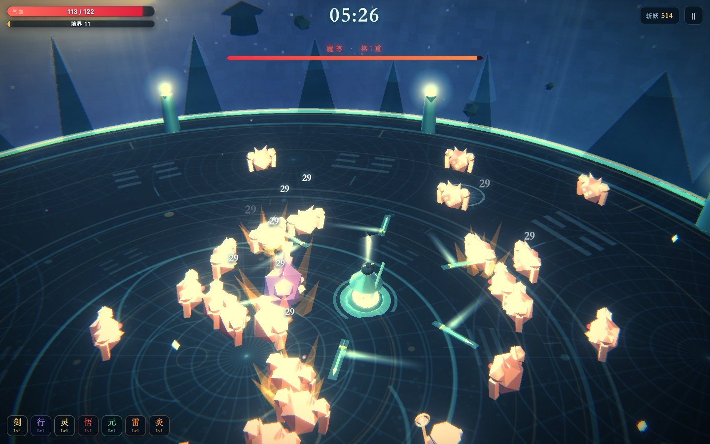 |
| 中后期战场：满屏妖魔四面合围、飞剑拖尾、大范围术法环 | 魔尊「裂地」前摇：地面红环画出危险范围 |
| 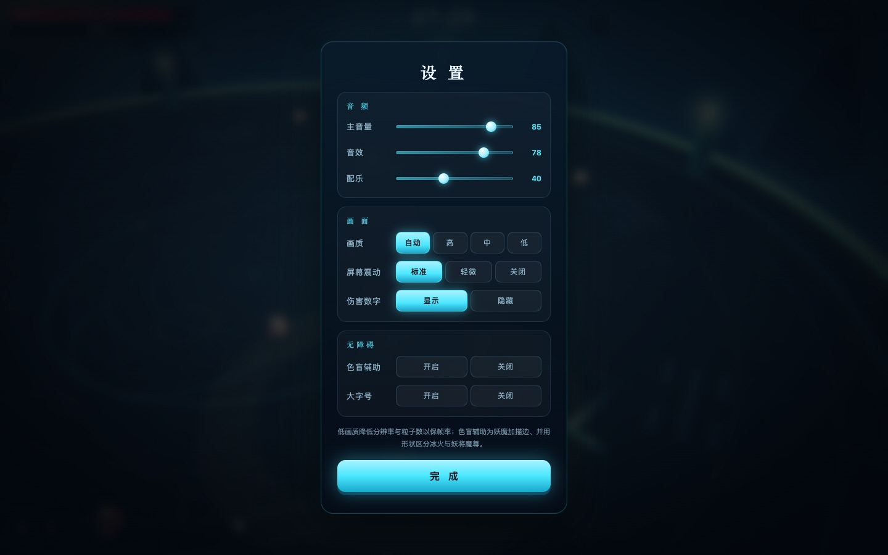 | 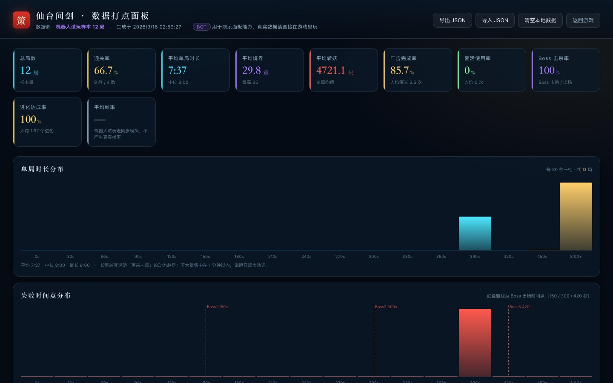 |
| 设置面板：音量 / 画质 / 震屏 / 伤害数字 | 数据打点面板：通关率、境界漏斗、败因分布、广告转化 |
|  | 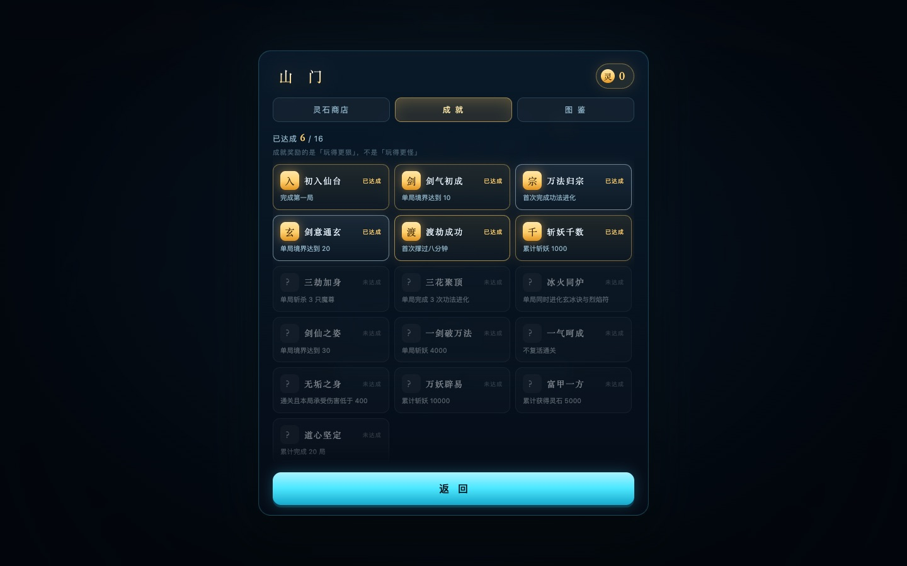 |
| 灵石商店：已满 / 买不起 / 可买三种状态同框 | 成就：16 项，按铜银金紫分级 |
| 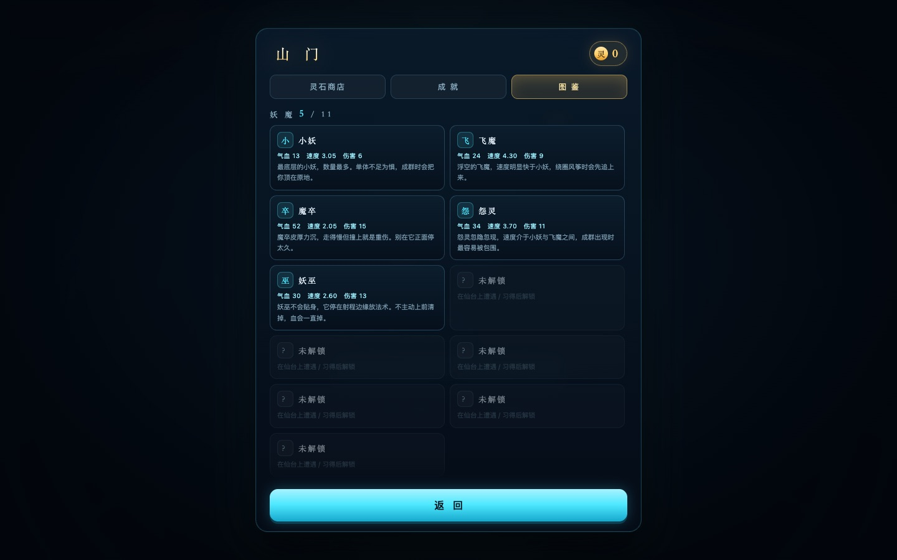 | 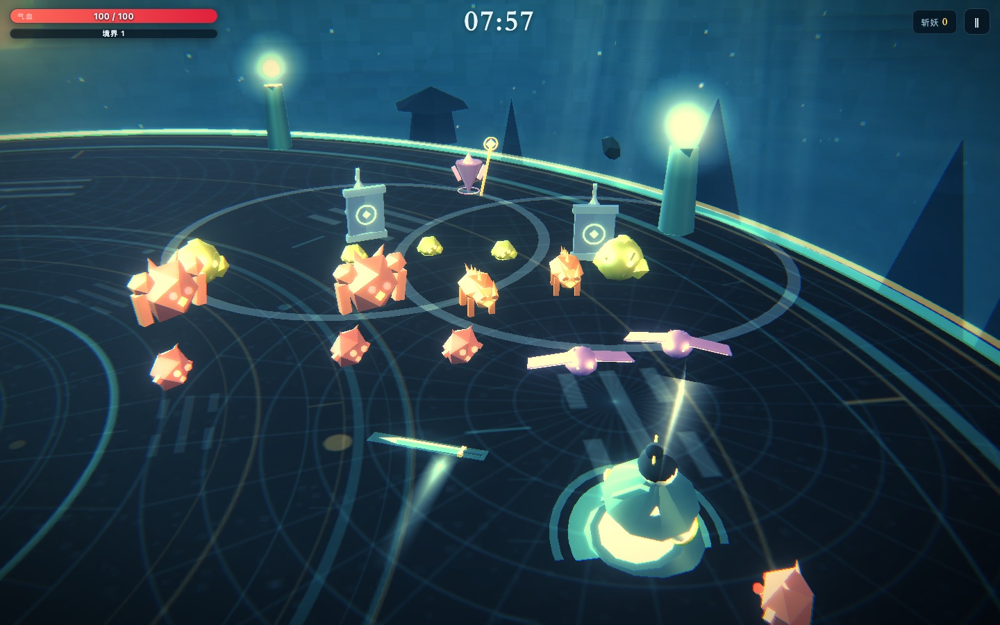 |
| 图鉴：妖魔 / 功法 / 进化三栏，未遭遇的留「？」 | 妖魔谱：11 种妖魔同框，每种一个颜色、一种走位要求 |
| 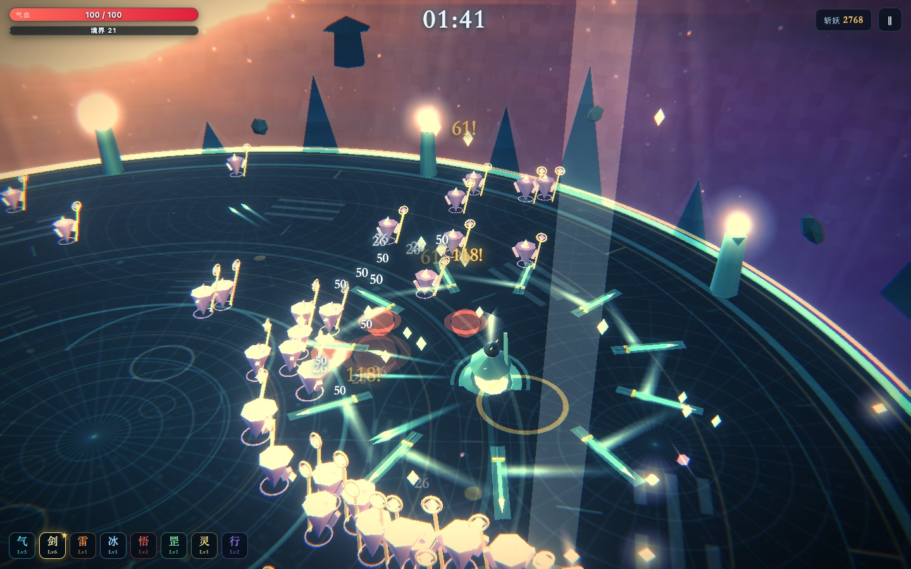 | |
| 局末破晓：天光随局内时长从冷夜转暖金，星空淡出、云海被扫光带过 —— **这张没调 `?warm=`，是机器人真打到 380 秒时的天色** | |
| 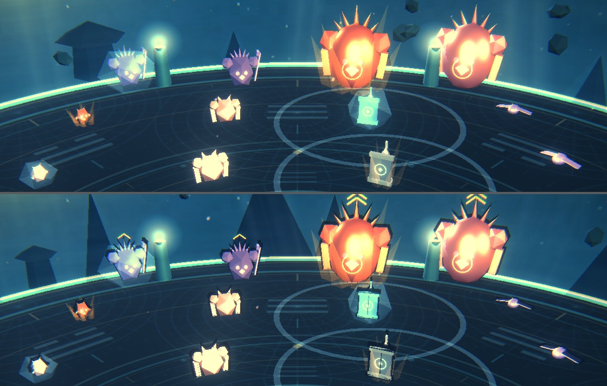 | |
| **无障碍开关 A/B**（上=关 / 下=开）：开启后每只妖魔都有深墨描边，妖将头顶 1 个「∨」、魔尊 2 个；冰壳是棱角晶体、火壳是向上火舌。每排都刻意留了一只**无状态对照**妖魔 —— 一张图同时回答三个问题：描边生效了吗、两种状态壳分得清吗、稀有度标记数得出来吗 | |

#### 小游戏打包产物（竖屏 500×860）

这一组**加载的是 `dist/minigame/game.js`，不是源码**；页面里没有 DOM，
所有界面都是 Canvas 2D 画的。所以它们同时是「打包产物真的能跑」的证据。

| | | |
|---|---|---|
| 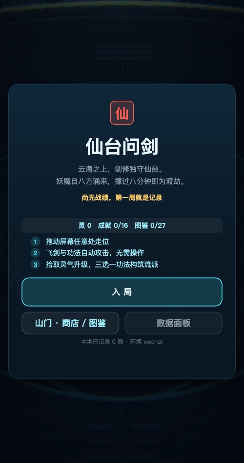 | 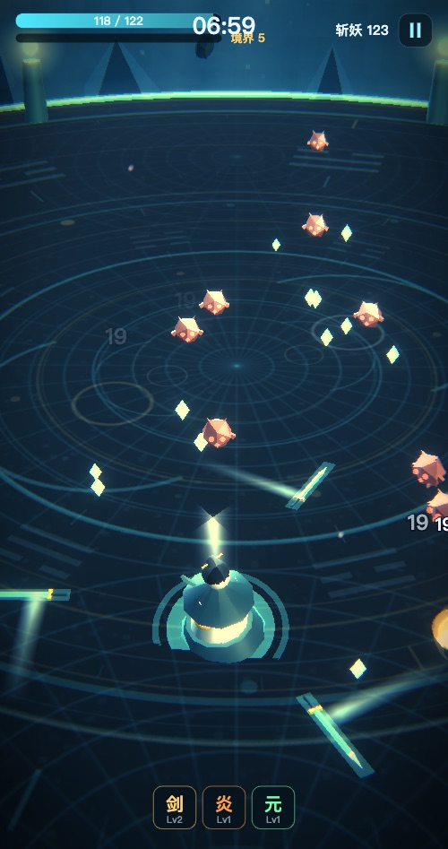 | 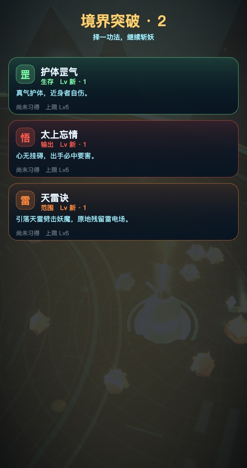 |
| 开始屏（空转探针 `changed=0 / redraws=1`） | 对局中（`t=60.43`；对局探针 `stale:false / wasted:false`） | 升级三选一（`t=20.32`，`hits=3`） |
| 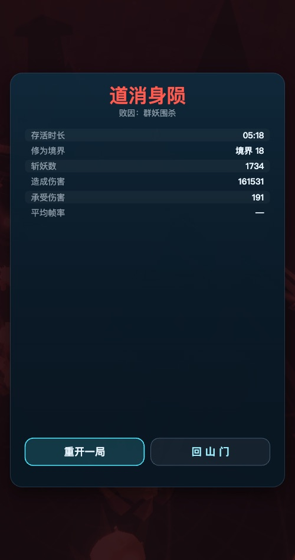 | 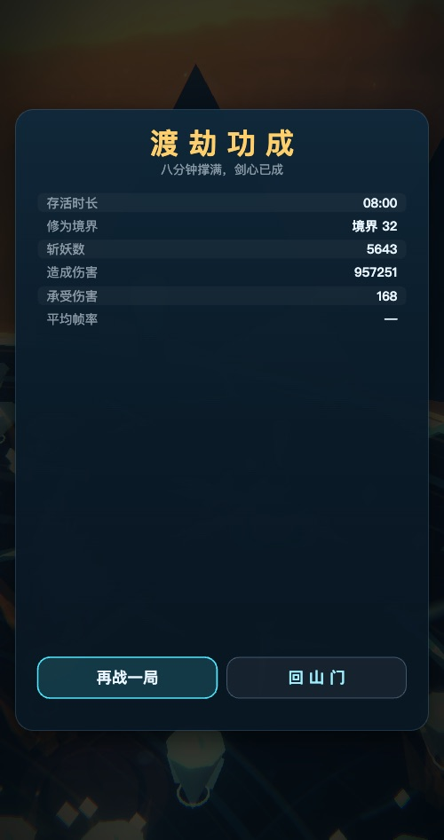 | 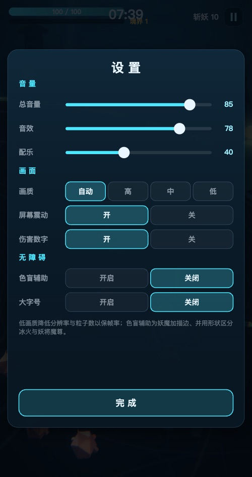 |
| 阵亡结算（`t=319.28`，`hits=2`）—— **只有「重开一局 / 回山门」两个按钮** | **通关**（`t=480`，境界 32） | Canvas 设置面板（`hits=17`） |
| 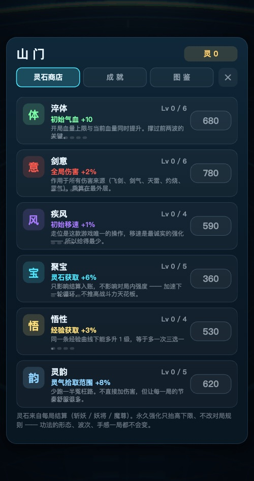 | 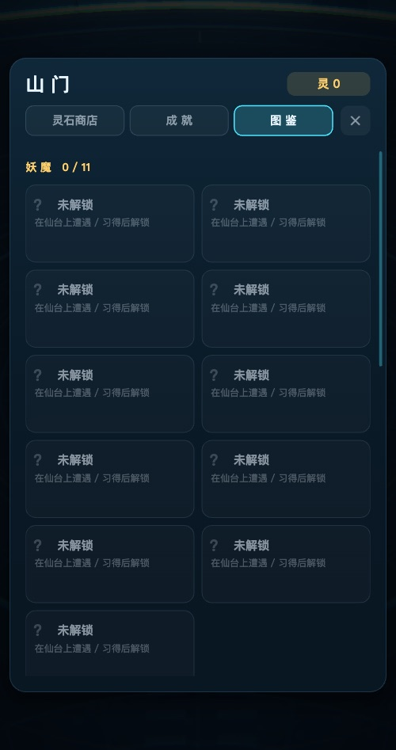 | 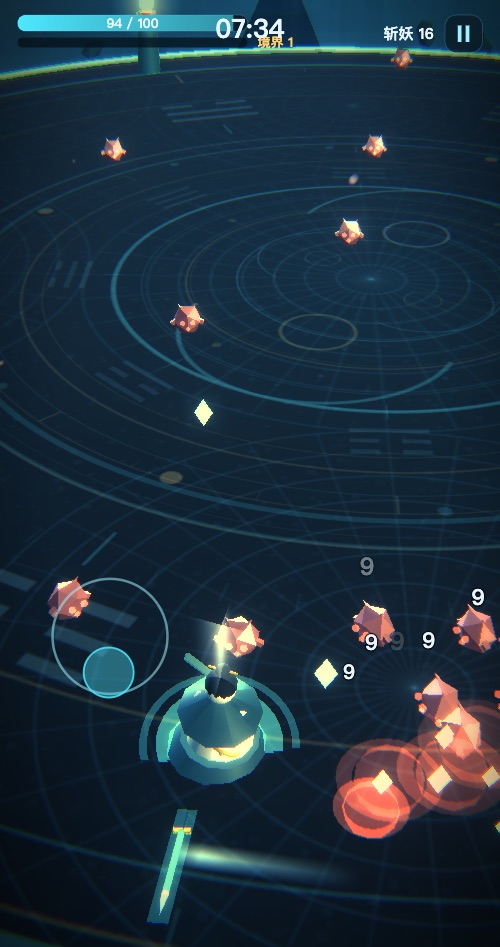 |
| 山门 · 灵石商店 | 图鉴 · 妖魔栏（未遭遇留「？」） | **触摸摇杆**（`?mgtouch=1`，`vecCos 1 / moveCos 0.954`） |

> **阵亡那张只有两个按钮，这是对的，不是缺了。** 模拟器这个宿主
> **没有广告 API**，所以「看广告 · 原地复活」**不该摆出来** ——
> 摆了就是一个点不动的按钮（点一次弹「广告未看完」，再点还是这一句，
> 按钮也不消失）。这张图曾经挂着三个按钮，而那张图比修复早两小时：
> **旧展品替我们宣传了一个已经修掉的缺陷。** 见下面「七个坑」第 5 条。

> 最后那张是唯一能看出**手机操作方式**的图：摇杆是浮动的，画在手指落点处。
> 它也顺带证明触摸层真的被执行过 —— 不走 `?mgtouch=1` 的话机器人直接写
> `Input.vec`，摇杆永远不会出现在画面上（对照读数 `starts: 0`）。

> **探针读数只写不变量，具体数字标注成「一次采样」。**
> 表里原来写着 `changed=29 / redraws=30`，看起来像一个固定属性；
> 实际上同一个查询连跑三次得到的是 `changed = 10 / 29 / 29` ——
> 它取决于那 30 帧里 HUD 有没有变化（满血、无击杀、计时没跨秒时
> `changed` 就是 0，而这是**正确行为**，`wasted:false` 说明它没白画）。
> 所以判据是 `stale:false`（没漏画）与 `wasted:false`（没白画）这两个
> **恒定的**量；把会波动的采样值写进文档，下次重出截图时它就会
> 看起来像一次回归。

> 表里的 `changed / redraws` 是**探针**读数，不是 `ui.redrawRate`。
> 后者是累计值，在同步走查里恒为 ≈0.968（`UI.render` 只在探针那 30 帧里
> 被调用，中间几千帧逻辑步进不渲染），**没有意义** —— 我一度把它写在这里当证据。
> 有意义的量是「有变的帧数」与重画次数是否对上，判据见上面「打包与验证」。

> 对局 / 升级 / 阵亡 / 通关四屏都来自**真实对局** —— `?mguntil=` 会一路打到
> 那个状态为止，不是编一份假 stats 去调 `showOver()`。
> 编数据只能证明「面板画得出来」，证明不了「游戏真的会走到这一步、
> 并且把数据传对了」。
>
> 通关那张是**重试**出来的：升级卡随机、这一局没接种子，
> 拉满强化 + 技能 1.0 实测三次里过一次。截图脚本因此会校验最终状态。
> 顺带一提：**三次样本说明不了通关率** —— 见下面平衡基准一节的样本量说明。

> 山门那三张刻意**不用**「一键全解锁」来拍。一张「六条全满 + 十六个全亮」
> 的图，和一张写死的图看不出区别 —— 它只能证明系统**存在**，
> 证明不了它能玩。所以商店造的是中期存档（两条已满、一条买不起、三条可买），
> 成就和图鉴只点亮前几条：**玩家平时真正面对的就是大半还是暗格的那一版**。
>
> 妖魔谱那张用了 `?zoom=` + `?spawn=` 而不是靠 `?play=N` 撞运气 ——
> 要展示的恰恰是「同屏能同时出现哪几种」，等它自然刷出来是不可复现的。

---

## 三、技术要点

这一节是给「看代码的人」的，也是这个项目真正想证明的东西。

### 1. 零素材：全部程序化生成

小游戏首包有 4 MB 硬上限，美术素材是最容易吃掉预算的部分。
这里的做法是**一个素材文件都不放**：

- **贴图**：`petalTexture` / `lanternTexture` / `bladeTrailTexture` /
  `baguaTexture` / `stoneTexture` / `cloudTexture` / `moonTexture` /
  `glowTexture` 全部用 `Canvas2D` 逐像素画出来再包成 `CanvasTexture`。
- **音效**：18 种音效全部由 `OscillatorNode` + `BiquadFilter` + ADSR 包络合成，
  噪声层用一段共享的 1 秒白噪声 buffer。
- **混响**：没有 IR 文件，`ConvolverNode` 的脉冲响应是**程序化生成的噪声指数衰减**。
- **配乐**：D 羽调式五声音阶，4 组和弦进行，`setInterval` + `currentTime` 前瞻排程，
  鼓点与沙锤的密度由「同屏妖魔数 / 是否有魔尊 / 是否残血」实时驱动。

结果：`vendor` 之外的全部游戏内容 **~250 KB**。

### 1b. 氛围层：一个着色器天球 + 几条加色平面

体积光 / 云海高光扫过 / 星空旋转 / 破晓色温全部是**着色器与加色平面**，
没有一张贴图、没有一次额外渲染目标：

- **天球**：一个半径 190 的 `BackSide` 球 + 一段片元着色器。三段渐变
  （地平线 / 中天 / 天顶）、星点（哈希噪声 + 天球旋转）、银河带、
  灵光带、以及**带方位的破晓色温**都在这一段里。
- **体积光**：5 片朝相机的加色平面（不是真体积散射 ——
  固定机位下两者看不出区别，而真散射在千元安卓上不划算）。
- **云海扫光**：一片复用顶层云贴图的加色平面，
  因为共用同一个 `Texture` 实例，UV offset 天然同步，不会漂。
- **破晓**：一个 `uWarm` 标量驱动全部受影响的材质（登记制），
  由 `World.update` 每帧写一次。它同时是一个**不用 HUD 的进度提示**：
  八分钟一局，天光从冷夜走到暖金，玩家会先「感觉到」快结束了，再看计时器确认。
  进度走的是 `runProgress^1.5`（不是线性）——线性时跑到一半天光已经变完 87%，
  整局中段都是一片紫，把「夜战」的身份冲掉了。压过之后夜战守得更久，
  戏剧性集中到最后三分之一，也更像真实黎明（先慢后快）。

代价是这类东西**极易做成「几何上不可见」**（俯视机位下画面顶边朝下 10°，
地平线根本不在画面里）。做法与踩坑见「排查视觉问题时可用的探针」一节。

### 2. Three.js r128 的色彩管线陷阱（踩过的坑）

r128 把十六进制颜色当**线性空间**处理，而渲染器 `outputEncoding` 设成
`LinearEncoding` 时数值会被原样写进帧缓冲。两个后果：

- 直接按「所见即所得」配色 → 整个场景暗三倍；
- 更隐蔽的一点：three.js 的漫反射 BRDF 里带 **1/π 归一化**，
  所以 `DirectionalLight(intensity: 1)` 打在纯白表面上只能得到 0.32 的亮度。

早期版本按「1.0 就是满亮」配光，妖魔直接糊成纯黑剪影。
现在的解法是**灯光强度整体乘 ~3**，并把三点布光（冷月主光 / 暖金补光 / 去青轮廓光）
的角度做成掠射，让低模靠轮廓而不是「顶面被照亮」来读形。

### 2b. 起不来的时候，别让用户看堆栈

**这是用户真的遇到过的一次失败**（不是假设）：双击 `index.html`，
屏幕上是一屏红字：

```
启动失败：
Error creating WebGL context.
Error: Error creating WebGL context.
    at new ws (file:///.../vendor/three.min.js:6:337663)
    at Core.init (file:///.../js/core.js:104:20)
    at HTMLDocument.boot (file:///.../js/main.js:359:15)
```

这条信息对用户是零价值的：他不知道发生了什么（WebGL 是什么？），
更不知道该做什么。而**WebGL 建不出来几乎总是环境问题**，
而且绝大多数情况用户自己能修。一个把「能修的问题」显示成
「一屏看不懂的堆栈」的交付物，在发行视角下就是不达标的。

所以做了三件事。

**一、探测能力，而且用一次性 canvas。**

```js
Core.probeGL = function () {
  var cv = document.createElement('canvas');   // ← 绝不能用 #scene
  ...
};
```

为什么强调「一次性」：**一张 canvas 只能有一种上下文**。
在真画布上试过 `getContext`，那张画布就被钉在这个类型上，
后面再想换一种就没机会了。探测失败不能连累真画布 ——
用户刷新一下、或者关掉几个标签页，就还有机会直接成功。

探完还要**主动 `WEBGL_lose_context`**：探测本身就是一次真实的上下文创建，
不还回去就等于白占浏览器那 16 个名额之一。

**二、降级链。** three.js 只在**全部**尝试失败时才抛，
而它自己那两跳（带属性 / 不带属性）用的是同一组 `contextNames`。
真机上确实存在「webgl2 建不出来但 webgl1 可以」的驱动，
以及「`powerPreference:'high-performance'` 被拒但默认可以」的省电模式：

```js
var attempts = [
  { name: 'webgl2+highperf', ... },   // 原来只有这一组
  { name: 'webgl2',          ... },   // 去掉 high-performance
  { name: 'webgl1',          ... },   // 把 webgl2 从探测顺序里拿掉
  { name: 'bare',            ... }
];
```

`webgl1` 那一组靠**临时**把 `canvas.getContext` 包一层、让 `'webgl2'` 返回
`null` 来实现，构造完立刻还原 —— 不能常驻，否则后面所有
`getContext('webgl2')` 都会莫名其妙拿到 null。

**降级链必须每次换一张新画布**，这是后来才补上的关键一条。

一开始每一跳都往**同一张** `#scene` 上重试，结果是降级链形同虚设：
`getContext('webgl2', attrs)` 一旦失败，这张画布就被**钉死在 webgl2 上**了，
后面拿 `webgl2` 也好、拿 `webgl1` 也好，统统返回 `null`。
（这也是为什么 three.js 抛的是 `Error creating WebGL context.` 而不是
`...with your selected attributes.` —— 它自己那两跳同样复用了同一张画布。）

```js
for (var i = 0; i < attempts.length; i++) {
  if (i > 0) cur = Core._freshCanvas(cur);   // ← 换一张干净的，重试才有意义
  ...
}
```

`_freshCanvas` 保留 `id` / `class` 和其余属性，插回原来的位置，
所以 `Core.canvas`、CSS 定位、事件绑定全都不受影响。
小游戏环境没有 DOM，它就退化成返回原画布 —— 那里由宿主管理画布，本来也不该换。

**四、失败面板带一个「复制诊断信息」按钮。**
`file://` 下 `navigator.clipboard` 常常不可用（不是安全上下文），
所以走 `textarea + execCommand` 兜底。复制出来的是纯文本 `键: 值`，
包含探测结果、回退链走到了哪一跳、UA、平台、窗口尺寸、dpr、CPU 核数、协议 ——
用户截一张图或者粘一段文字，就能定位到环境，不用来回问。

**三、失败面板按「结论 → 办法 → 细节」排。**

普通用户只需要前三行，要报 bug 的人展开 `<details>` 复制堆栈：

> **显卡加速没打开，游戏起不来**
> 这个游戏需要浏览器的 WebGL（3D 绘图）能力，刚才没能建出来。
> 探测显示**你的浏览器是支持 WebGL 的** —— 多半是标签页开太多、
> 或者上一次的 3D 上下文还没释放。
>
> 1. **刷新这个页面**（⌘R）—— 上下文释放后常常一次就成
> 2. **关掉其他开着 3D / 视频 / 地图的标签页**（浏览器同时只允许约 16 个 WebGL 上下文）
> 3. **确认硬件加速是开着的**（Chrome：设置 → 系统 → 使用硬件加速模式）
> 4. **换个浏览器**

面板里还带一张**探测结果表**（WebGL 2 / WebGL 1 / 渲染器 / 厂商）。
没有这张表就分不清「浏览器不支持」和「驱动或加速被关」——
这两种情况的修法完全不同。

**验证方式：反向对照，不是「看着没问题」。**

| 场景 | 怎么造 | 结果 |
|---|---|---|
| 完全没有 WebGL | Chrome `--disable-3d-apis` | 显示失败面板，探测表报 WebGL 2/1 **均不可用** |
| 只有 WebGL 1 | 探针页里把 `getContext('webgl2')` 改成返回 `null` | **自动降级到 WebGL 1 并正常开局**（`gl: WebGL 1.0`），只有一条无关的纹理缩放警告 |
| 正常 | 默认 | `state: playing`，`ERRORS: none` |
| **真实环境：浏览器本身没有 WebGL** | 在一台 Chrome 152 上直接跑（见第〇节） | 失败面板正确报出「当前浏览器拿不到 WebGL」；同一台机器的 Safari 报 `webgl2:true / Apple GPU`，完整跑完 10 秒零报错 |

第二行才是真正有价值的那条：它证明降级链**不是写着好看的**。
最后一行是**唯一一次真实用户环境的失败**，它同时说明了两件事：
失败面板的文案是对的（问题确实在浏览器侧），
以及**降级链救不了「一个上下文都建不出来」的情况** —— 那种情况只能换浏览器。

诊断里同时加了 `glAttempt`，报出最终是哪一组参数建起来的。
正常是 `webgl2+highperf`；一旦是别的值，说明这台机器发生了降级 ——
这是**环境问题不是游戏问题**，但值得记：降级能跑通，却往往伴随
性能或特性差异（WebGL1 的 instancing 扩展、颜色管线都不同），
「画面比别人的暗/慢」这类反馈有了它就不用猜。

### 3. 实例化与合并几何


每种妖魔只占 **2 个 draw call**（本体 + 发光件）：

- 同类型的角、臂、翼、躯干先用 `mergeGeos` 合并成一个非索引 `BufferGeometry`，
  每个顶点带上颜色属性；
- 再用 `InstancedMesh` 批量绘制，直接写 `instanceMatrix.array`（列主序），
  所以可以做出**非等比缩放 + 剪切**：出场回弹、受击压扁、高速前倾都是这么来的。

满场 5000+ 击杀时 draw call 稳定在 **110~160**，三角形 8k~40k。

### 4. 空间哈希做碰撞

`CELL = 4` 的网格 + `Int32Array` 时间戳，避免每帧重建。
三个**互相独立的** scratch 数组（`scratchSep` / `scratchHit` / `scratchBlast`），
因为分离、命中、范围伤害三种查询会嵌套调用，共用一个数组会被互相覆盖。

### 5. 程序化动画（没有骨骼、没有动画文件）

- 玩家：步态相位驱动摆臂、躯干前倾、衣摆外扩、头部反向补偿；
- 妖魔：出场 `ease-out + 过冲` 的弹出、受击**压扁拉伸**、
  速度驱动的前倾剪切、冰缓时的高频抖动；
- 飞剑与剑气：拖尾是切向对齐的扁平四边形，实例化后各占 1 个 draw call。

### 6. 打击感

| 手段 | 实现 |
|---|---|
| 顿帧 | 暴击 / 挨打 / 魔尊倒地时把 `dt` 乘 0.18，持续 0.085~0.42 秒 |
| 震屏 | `Core.addShake()`，幅度随伤害量缩放 |
| 色差脉冲 | 后处理 `uAberration` 在受击瞬间拉高再衰减 |
| 残血心跳 | 血量 <34% 时暗角收缩 + 边缘泛红，频率 4.6 Hz |
| 升级仪式 | 脚下炸金环 + 冲天光柱 + 全屏金光 |
| 首领登场 | 1.5 秒「降临」+ 地面血环 + 屏幕预警 |
| 首领招式 | 裂地：原地定身 1.1 秒，地面画出危险范围，然后炸开 |

### 7. 无人值守的验证与平衡

这是这个项目里最「工程」的部分。图形项目最难的是**没法自动验证**，
而手感调优需要几十上百局数据。

做法：`?play=N` / `?farm=K` 查询参数进入**同步模拟模式** ——
用一个 `while` 循环直接步进 `update(1/60)`，跑完再把 `frozen = true`
进入只渲染不推进的 rAF 循环，让 WebGL 缓冲活到截图时刻。
`tools/render.sh` 用无头 Chrome 跑一遍，同时输出截图和一段 JSON 诊断。

在此基础上写了**带技能档位的机器人**（`botSkill` 0~1）：
有反应延迟、手抖、贪心系数，以及**有限的注意力**（只处理最近的 N 个威胁）。
这一点很关键 —— 一个全知全能的完美风筝机器人只会产出「100% 胜率」这种没用的数据。

### 8. 数据打点

`telemetry.js` 记录每局的等级曲线、功法选择偏好、死因、广告转化、里程碑时间点。
`data.html` 是一个独立的数据面板，把机器人试玩样本渲染成 KPI、漏斗和分布直方图。

`data/seed-data.js` 是自动生成的机器人样本（8 局），
让面板在没有真实数据时也能看。

### 9. 无障碍：形状优先于颜色

这一项的起点是一个具体的失误：冰缓与灼烧**共用一个二十面体**，
只靠 `instanceColor` 区分青与橙。对红绿色盲（约 8% 的男性玩家）来说，
这是「两个灰度的同一种形状」—— 而这两个状态在玩法上完全不同
（减速 vs 持续掉血），玩家据此决定「往冰域里引还是往外拉」。
**只靠颜色编码的状态，对这部分玩家等于没有编码。**

修法不是把颜色调得更艳，而是**让轮廓本身不同**：

| 状态 | 几何 | 面数 | 读法 |
|---|---|---|---|
| 冰缓 | 二十面体（`IcosahedronGeometry(1,0)`） | 20 | 一块有棱角的晶体 |
| 灼烧 | 6 根倾斜锥 + 1 根中央高锥（合并） | 84 | 向上窜的火舌 |

形状差异对**所有**玩家都有用（密屏时比颜色更快扫到），
所以这一个额外 drawcall 值。诊断里专门加了 `frostGeoFaces` / `burnGeoFaces`
做**绊线** —— 将来谁把两个外壳合并回去，这两个数字会立刻变成一样。

**描边用「反向外壳」（inverted hull）**：把本体几何原样再画一遍、
沿法线外扩一点、`side: BackSide`，深度缓冲会把内部挡掉、只留轮廓线。
代价是每种妖魔多一个 drawcall，**显存零增量**（几何是共享的）。
不用 rim-light 着色器，是因为妖魔本体是**按类型合并后的实例几何**，
改材质等于要把每套变体重建一遍。

三个必须做对的地方：

1. **描边宽度必须在世界空间恒定，不能是一个固定缩放系数。**
   统一 `1.055` 的结果是：小妖（0.42 米）拿到 2 厘米描边，25 米外不到 1 像素；
   魔尊（2.1 米）拿到 11 厘米。也就是「越小的怪越看不见」——
   恰好和需求相反。改成按类型反推
   `outlineK = 1 + OUTLINE_W / max(radius, height/2)`，每种怪的屏幕宽度才大致相等。
2. **细线会被泛光吃掉。** 0.07 米（25 米外约 2.7 像素）在缩略图里「看着还行」，
   放大四倍几乎找不到；0.12 米（约 4~5 像素）才能活过 `UnrealBloomPass`。
3. **描边要忽略雾**（`fog: false`）。场景有 `FogExp2(0.0126)`，
   带雾的描边会在妖魔**最远**的时候淡进背景 —— 而那正是这个功能存在的场景。

**描边颜色是量出来的，不是挑出来的。** 加了 `?outline=` / `?outlinew=` 之后，
按轮廓亮度梯度能量（`|∇lum|` 均值 / p95 / p99）测了三种颜色：

| 方案 | 均值 | p95 | p99 |
|---|---|---|---|
| 无描边（基线） | 9.844 | 45.2 | 140.7 |
| 亮白 `dff2ff` | 10.921 | 50.1 | 164.0 |
| 深墨 `0a1520` | 10.759 | 49.5 | 160.4 |
| 青 `16e0ff` | 10.592 | 51.4 | 148.2 |

三者**都在 3% 以内**，即颜色不影响可读性。于是这一项改用美术语义决定：
**选深墨**，因为青是玩家阵营色（飞剑 / 剑气 / 冰域 / 台面符文），
给妖魔套青色描边会被读成「友方效果」；深墨也是赛璐璐描边的惯例。
**「哪个更好看」这种问题要么能测、要么承认它在测；不要用「我觉得」代替数据。**

**大字号模式用了一个全局 CSS 变量，而不是逐个选择器改。**
样式表里有 97 处 `font-size`，逐个挑选择器**一定会漏**，而且漏是静默的
（「有的字大了有的没大」）。做法是全部包成 `calc(Npx * var(--fs, 1))`，
`body.bigtext` 只改 `--fs` 一处；一条脚本就能证明没有漏网的
（`grep -c 'font-size' | 对比 calc 包裹数`）。

但**「整体放大」必须配一次「容器还装不装得下」的复核**，这一轮撞了两次：
`--fs: 1.25` 时设置面板溢出、把「完成」按钮挤出屏幕，且「屏幕震动」
被挤成两行；改到 `1.18` 之后，新加的「无障碍」分组又把同一个按钮
挤掉了几个像素 —— 面板是可滚动的，**所以完全没有报错，是静默裁切**。
最后是压间距（`.sgroup` / `h2` 的 margin 18→14）、
把标签列定宽到 86px、再把两行提示合并成一行才收住。
**只要动了字号，就必须回头看一眼主按钮还在不在。**

---

## 四、调试参数

| 参数 | 作用 |
|---|---|
| `?play=N` | 同步模拟 N 秒后冻结（用于截图与状态检查） |
| `?gesture=1` | **派发一次真实的 `pointerdown`**。音频解锁挂在这个事件上，而机器人用的是 `.click()` —— 不派发的话音频永远不会解锁，「一个音都没出去」是预期行为。要验音频必须带上它 |
| `?farm=K` | 连打 K 局机器人对局，跑完输出汇总 |
| `?farmwall=N` | 批量跑局的墙上时间上限（秒，默认 **240**）。跑 48 局需要 300s+，**不改它就会被静默截断** —— 见下面「被截断的样本」一节 |
| `?skill=0.7` | 指定机器人技能档位 |
| `?status=1` | **强制给全场妖魔挂上冰缓 / 灼烧**，用于验证状态视觉 |
| `?tip=1` | 常驻教学提示条（`?tip=文案` 可自定义） |
| `?settings=1` | 启动即打开设置面板 |
| `?evo=<id>` | 灌满指定功法并弹出进化面板（`sword`/`qi`/`thunder`/`ember`/`frost`/`aura`） |
| `?part=1` | 配合 `?evo=`：只追到一半（验证「→ 目标 3/6」进度标签） |
| `?takeevo=1` | 配合 `?evo=`：直接完成进化，不弹面板 |
| `?nobot=1` | 冻结机器人的自动点击（否则它会把你正在看的界面点掉） |
| `?meta=1` | 启动即打开山门面板；`?meta=ach` / `?meta=codex` 指定 Tab |
| `?nometa=1` | **假装一件永久强化都没买** —— 可复现的平衡基线 |
| `?metamax=1` | **假装永久强化全部拉满** —— 量「玩到后期」的天花板 |
| `?grant=N` | 给 N 灵石（调试商店购买流程） |
| `?metaunlock=1` | 点亮全部成就与图鉴（UI 走查） |
| `?achdemo=1` | 弹三条成就浮层（浮层只活 3 秒，随机截图抓不到） |
| `?build=1` | 诊断里附带构筑快照（功法等级 / 进化 / 实际数值） |
| `?mat=1` | 输出材质 / 灯光 / 顶点色 / 法线的诊断信息 |
| `?full=1` | 诊断里附带完整对局数组 |
| `?metaset=hp:6,power:3` | **造一个指定的中期存档**（比「全满」有用，见下） |
| `?reveal=N` | 每类只点亮前 N 条成就 / 图鉴，造「半亮」状态 |
| `?zoom=0.45` | 把相机拉近（越小越近）—— 否则妖魔只占几十像素，看不出造型问题 |
| `?spawn=guard:2,imp:6` | 在玩家身前直接刷出指定妖魔，配合 `?preroll=N` 出图 |
| `?layer=body` | 只显示本体层（`glow` 则只显示辉光层） |
| `?bloom=0` | 关掉泛光 |
| `?preroll=N` | 跑 N 秒再出图（不冻结），常与 `?spawn` / `?cam` 搭配 |
| `?settle=N` | 配合 `?spawn=`：摆完妖魔再推进 N 秒 —— 不推进的话拍到的是「材质化」第一帧 |
| `?cam=x,y,z,lx,ly,lz[,fov]` | 指定机位与朝向 —— **美术 A/B 的前提是两张图同机位** |
| `?topcam=1` | 俯视全场 |
| `?seed=N` | 固定场景布局（山形 / 云 / 灯笼 / 光柱），让两张截图可比 |
| `?warm=0~1` | 直接把破晓进度钉在指定值（`0` 夜 / `0.85` 局末） |
| `?noatm=1` | 关掉全部加色氛围层（体积光 + 云海扫光） |
| `?rays=N` | 光柱整体亮度 ×N（`0` = 关掉）—— 用来定位光柱落在画面哪儿 |
| `?sweep=N` | 云海扫光整体亮度 ×N（`0` = 关掉） |
| `?cloud=N` | 云海各层不透明度 ×N（`0` = 关掉云海） |
| `?a11y=cb,big` | 走查用：开色盲辅助 / 大字号（`none` 强制全关）—— 走的是和玩家点开关**同一条路径** |
| `?a11ydemo=1` | 摆一组**固定编队**（每排都带一只「无状态」对照）并冻结，用于无障碍 A/B |
| `?nohud=1` | 关掉 HUD —— 让 A/B 图里只剩妖魔，排除界面元素干扰 |
| `?outline=<hex\|dark\|light\|cyan>` | 改描边颜色（默认深墨 `0a1520`）—— 用来量化「颜色到底影响不影响可读性」 |
| `?outlinew=<米>` | 改描边在世界空间的目标宽度（默认 0.12 米）—— 用来量化「多宽才看得见」 |

**小游戏版**（`dist/minigame/game.js`，走 `sim.html`）。小游戏没有 URL，
但 `wx.getLaunchOptionsSync().query` 就是 URL 的等价物，
而且分享卡片带参数走的也是这条路，所以它顺带验证了参数链路：

| 参数 | 作用 |
|---|---|
| `?mgplay=N` | 同步跑 N 秒后冻结（升级自动选牌），用于对局截图 |
| `?mguntil=<state>` | 跑到指定状态为止：`levelup` / `over` / `win` —— **全程走真实对局** |
| `?mgcap=N` | 配合 `?mguntil=`：最多跑 N 秒游戏时间（默认 900） |
| `?mgui=<屏>` | 把 UI 钉在某一屏：`start` / `settings` / `meta` / `meta-ach` / `meta-codex` |
| `?mgmeta=max\|blank` | 局外成长档位（全满 / 全空），自动置 `offline`（不写真实存档） |
| `?mggrant=N` / `?mgreveal=N` | 给 N 灵石 / 每条只点亮前 N 项成就与图鉴 |
| `?mgskill=0~1` | 机器人技能档位 |
| `?mgtouch=1` | **触摸驱动**：机器人改为从宿主触摸回调驱动（而不是直接写 `Input.vec`），并核对方向一致性 |
| `?mgad=ok\|skip\|fail` | 给模拟器装一个**激励视频桩**：看完 / 中途关掉 / 拉取失败。不写这个参数时宿主**没有**广告 API（降级路径） |
| `?mgtap=<文字>` | 按**按钮文字**点一下（走触摸层），并报告点完的状态迁移。配合 `?mguntil=over\|win` 用 |
| `?mgquality=<档>` | 锁死画质档位（低端机走查用） |
| `?mgcb=1` / `?mgbig=1` | 开色盲辅助 / 大字号（Canvas UI 版） |

> `?mgtouch=1` 为什么必须有：机器人默认**直接写 `XS.Input.vec`**，
> 那**绕过了整条触摸层** —— `js/minigame/input.js` 里的死区、归一化、
> UI 优先、多指识别于是从来没执行过。这个模式把机器人的意图**反解**成
> 摇杆位移，从宿主的 `onTouchStart / Move / End` 发出去，让那一层真的算一遍，
> 再报两个余弦相似度：`vecCos`（触摸算出的 vec vs 意图，测映射）
> 与 `moveCos`（人物实际移动方向 vs 意图，测「输入接到了移动上」）。
> 实测 `vecCos 1.0 / moveCos 0.97`，`uiEats 0`（摇杆起点没落进 UI 命中区）。
> 反向验证见下面「打包与验证」。

> `?mguntil=win` 是个**概率事件**：升级卡是随机的，拉满强化 + 技能 1.0 下
> 实测三次里过一次。所以 `tools/make-docs.sh` 的 `mgshot` 会校验最终状态，
> 不对就重试，四次都不对就报错 —— 否则脚本会安安静静地把一张「阵亡结算」
> 存成 `screenshot-mg-win.jpg`，图看着完全正常，只是不是你要的那一屏。
> （注意：**三次样本量说明不了通关率**，见下面平衡基准一节。）

> `?farm` 会自动打开 `blank` + `offline`：**零强化、不写档**。
> 否则一次 16 局的平衡测试会把真实存档灌满灵石、顺带把成就全部点亮，
> 之后所有测量都不再可信。要测满强化就叠 `?farm=16&metamax=1`。

诊断里的 `farm` 会自述**要了几局 / 跑出几局 / 为什么停**：

```
farm: want 48 | got 48 | stop done | wall 320.4s | steps 1188394/1620000
```

`stop` 是 `done`（跑满）或 `wall`（撞上 `?farmwall=` 上限被砍断）。
**跑不满就一定会打 ⚠。** 这一项是补上的：以前只有 `totalRuns: 35`，
读的人只能自己编原因 —— 而上一次的归因（「虚拟时间预算不够」）
是错的，真因是循环内部写死的 240s 兜底。详见下面「被截断的样本」一节。

诊断里还会带上 `status`（各状态计数）、`fx`（当前活着的特效种类 / 坐标 / 半径）
与 `meta`（存档等级 + 实际进 `player` 的数值）——
最后一个专门用来回答「我买了强化，但它真的进对局了吗」。
只对比存档是不够的：存档里有等级、但没进 `player`，是两回事。

命令行：

```bash
tools/render.sh /tmp/shot.png 20000 "?play=200"          # 截图 + 诊断
tools/render.sh /tmp/x.png 150000 "?farm=16"             # 十六局机器人试玩 + 平衡汇总
tools/render.sh /tmp/m.png 150000 "?farm=16&metamax=1"   # 满强化下的通关率上限
tools/render.sh /tmp/s.png 9000 "?meta=1&metaunlock=1"   # 山门面板截图
tools/make-seed.sh 12                                    # 重出数据面板的兜底样本
tools/make-docs.sh                                       # 重出作品集截图（全部）
tools/make-docs.sh battle dawn                           # 只重出名字含 battle / dawn 的那几张
tools/make-docs.sh mg                                    # 只重出小游戏那八张（走打包产物）
```

### 平衡基准（**先读下面 2026-09-15 的 n=160 那张**）

> **这一节的数字已经被取代，保留是为了说明「结论怎么被推翻又怎么被扶正」。**
> 当前应当引用的基准是下面「把 n 跑满」一节：**基线 57.5% / 天花板 85.0%（各 160 局）**。
> 下面这张表的绝对值**没有被证伪**（差异都在 1 个标准误内），
> 只是样本量（各 48 局）不足以支撑任何精度更高的说法。

2026-09-13，两组各 48 局，机器人自动试玩：

| 指标 | 基线（零强化） | 天花板（强化全满） | 解读 |
|---|---|---|---|
| **通关率** | **54.2%** | **81.3%** | 目标带是「满强化 ≈ 70~80%，还输得掉」—— 落在上沿 |
| 平均时长 / 中位 | 435s / 480s | 466s / 480s | 大部分对局能进到最后 1 分钟 |
| 平均境界 | 27.5 | 30.9 | 满强化多约 3 次三选一 |
| 平均击杀 | 4181 | 5037 | |
| 进化达成率 | 81.3% | 93.8% | |
| 魔尊击杀率 | 92.0% | 95.7% | Boss 战不是卡点，终局压力来自杂兵 |
| 败因分布 | 妖将 59% / 群妖 41% | 群妖 56% / 首领 22% / 妖将 22% | 不再集中在单一怪种 |
| 广告完播率 | 82.7% | 82.4% | |
| draw call / 三角形 | 149 / 8.9k | 同左 | 满屏 44 只妖魔时 |

**样本量是这份表的一部分，不是脚注。** 同一个构建，n=16 测出「天花板 56.3% < 基线 68.8%」
（方向完全反了，差点去查局外强化有没有生效），n=48 才反转成合理的方向。
n=16 时标准误约 **12 个百分点**，12~18pp 的差异**完全在噪声里**。
**引用通关率必须带上 n；要区分 10pp 量级的差异，n 至少 48。**

**调平衡时最该记住的一件事**：终局难度本质是个**阈值**，不是渐变。
「能不能压住刷怪速度」是个阶跃函数，所以玩家 DPS 变化 20% 可能让胜率
从 20% 跳到 80%。实测把进化倍率从 ×2.5~3.3 收到 ×2.0，胜率就从 87.5% 回到 43.8%。
**不要按线性直觉调难度，每次只动一个量、每次都重新测。**

> **出处注记**：上表（2026-09-13）是用**重构前**的机器人测的。
> 后来把走位大脑与选牌策略抽成 `js/bot.js` 给两个宿主共用
> （见第五节「移植清单」），Web 侧的选牌行为因此有微小变化 ——
> 原来抓 DOM 文本判等级（`已习得 Lv3`），现在读 `game.js` 的 `current` 字段。
> 所以那 48×2 局的**测量主体**已经和现在的代码不是同一个了。

**2026-09-15 复测（换了共用机器人之后）**：

| 指标 | 基线（零强化） | 天花板（全满） |
|---|---|---|
| 实际局数 | **35**（不是 48） | **40**（不是 48） |
| 通关率 | 45.7% | 90.0% |
| 平均时长 / 中位 | 423.5s / 421.3s | 470.9s / 480s |
| 平均境界 | 27 | 31.3 |
| 平均击杀 | 3811 | 5363.6 |
| 进化达成率 | 82.9% | 95% |
| 魔尊击杀率 | 92% | 99.1% |
| 广告完播率 | 79% | 77.9% |
| 败因分布 | 妖将 57.9% / 群妖 36.8% / 首领 5.3% | 妖将 75% / 首领 25% |

**这次没跑满 48 局** —— 原因不是当时写的「虚拟时间预算不够」，
而是循环内部写死的一条兜底。见下面「被截断的样本」一节。
所以它**不能替换**上面那张表，只能当一次交叉验证。

- **能得出的结论**：方向一致，且差距极大 —— 44.3 个百分点，
  差异标准误约 9.7pp（约 4.6 个标准误），「天花板 > 基线」在这一发里是稳的。
- **不能得出的结论**：通关率的**绝对值**有没有变。基线 54.2% → 45.7%
  （差 8.5pp，标准误约 11pp）、天花板 81.3% → 90.0%（差 8.7pp，
  标准误约 7.4pp）—— 两个差异都在 1 个标准误上下，
  **分不出「换了机器人」和「随机波动」**。

### 2026-09-15 补测：把 n 跑满

上面那两条「不能得出的结论」当时没法往下走，因为样本被砍断了。
修掉截断之后重跑。先跑 n=48（确认截断问题真的解决了），再跑 **n=160**
（按 12.5pp 这个效应量反算，80% 检验力大约需要每组 200 局，
先跑 160 看趋势）：

| 指标 | 基线（零强化） | 天花板（全满） |
|---|---|---|
| **实际局数** | **160 / 160（stop: done）** | **160 / 160（stop: done）** |
| 通关率 | **57.5%** | **85.0%** |
| 平均时长 / 中位 | 434.8s / 480s | 465.2s / 480s |
| 平均境界 | 27.7 | 30.7 |
| 平均击杀 | 4245.6 | 5139.8 |
| 魔尊击杀率 | 92.1% | 98.5% |
| 进化达成率 | 82.5% | 96.9% |
| 广告完播率 | 84.1% | 82.6% |
| 败因分布 | 妖将 54.4% / 群妖 44.1% / 首领 1.5% | 妖将 75% / 群妖 25% |

**结论：n=48 那次读出来的 12.5pp 是噪声，真值约 27.5pp。**

| 对比 | 差值 | 差异标准误 | 几个标准误 |
|---|---|---|---|
| 天花板 − 基线（n=160×2） | **27.5pp** | ≈ 4.8pp | **5.7 SE** ✅ |
| 天花板 − 基线（n=48×2，同一构建） | 12.5pp | ≈ 9.2pp | 1.4 SE |
| 基线 vs 2026-09-13（54.2%） | +3.3pp | ≈ 8.2pp | 0.4 SE |
| 天花板 vs 2026-09-13（81.3%） | +3.7pp | ≈ 6.3pp | 0.6 SE |

- **方向现在是稳的**：5.7 个标准误。而且 n=48 与 n=160 是**同一个构建**，
  两者对同一件事的读数却差了一倍多（12.5 vs 27.5pp）——
  这是「n 必须和百分比一起报」最干净的一次现场演示。
  （两次并不矛盾：12.5pp 的差本身就落在 1.4 SE 里，只是它**看起来像**一个结论。）
- **绝对值仍然没有可证实的漂移**：两个对比都在 1 个标准误以内。
  也就是说，换共用机器人这件事**没有**改变通关率的绝对值。
  这一条以前答不了，现在能答了。
- **天花板 85.0% 略微超出「70~80%」目标带**，但 5.0pp / 2.8pp ≈ 1.8 SE，
  **还不到该动数值的程度** —— 要判定它真的越界，得再加样本。
  这正是「不要在噪声上调难度」那条规则的执行现场：先加 n，再决定改不改。
- 设计上的可读结论：**零强化 57.5% 有挑战、满强化 85.0% 明显更顺**，
  局外成长确实兑现了，只是兑现得比 n=48 时看起来更充分。

> **一条被复用了两天的结论**：「天花板 > 基线是稳的」这句话在
> 27pp 的效应量下成立（约 3.0 SE），在 n=48 读出的 12.5pp 下**不成立**。
> 结论是**跟着某一次测量**的，效应量变了就得重算 ——
> 直接沿用上一次的「稳」是另一种形式的「产物过期」。
> 而这一次的教训更深一层：**那个 12.5pp 本身也是假的**，
> 它只是一个 n 偏小的高估噪声。**「测出来了」和「测准了」是两件事。**

### 被截断的样本：一个偏小的 n 会被当成结论

补测之前先要回答「为什么 35/40 局就停了」。当时的归因是
**「`--virtual-time-budget` 不够」** —— 这个归因是错的，
而且错得很贵：那个参数调多大都不会有用。

真因在循环里：

```js
/* 兜底：同步循环最多占用 240s 墙上时间，避免无头环境挂死 */
if ((guard & 1023) === 0 && XS.Platform.now() - wallStart > 240000) break;
```

实测 4 局用掉 **26.7s** 墙上时间 → 48 局约 **320s** > 240s。
**限制在「被测代码」里，不在命令行上。** 于是查参数、查预算、
查机器性能，全都在错误的层里转。

而且它是**静默** break：诊断里只有一个偏小的 `totalRuns`，
没有任何一处说「没跑完」。**一个被砍断的样本和一个完整的样本
长得一模一样。**

两条改动：

1. `?farmwall=<秒>` 放宽上限（默认仍是 240s）；
2. 诊断里自述停因 —— 跑不满就一定会打 ⚠：

```
farm: want 48  | got 48  | stop done | wall 310.1s | steps 1247912/1620000
farm: want 160 | got 160 | stop done | wall 468.0s | steps 4200704/5248800
```

`stop` 是 `done`（跑满）或 `wall`（被砍断）。同一条规则也补给了
小游戏走查：`?mguntil=` 现在报 `{target, state, why, reached}` ——
实测有一发 `steps 24893/25200`，**离上限只剩 307 步**，
以前这个「差点被砍断」是完全不可见的。


最近一次调整（加入裂魔/盾卫/魔尊第二套招式之后）：天花板一度升到 87.5%，
死亡时间直方图显示死亡集中在 390~430 秒 —— 正好落在 `t=398/414/432` 三波上，
于是只把这三波的 `rate` 抬了约 19%（不动整条曲线），天花板回到 81.3%。

---

## 五、小游戏发行：体积、改造与打包

### 体积审计（微信首包 ≤ 4 MB，抖音首包 ≤ 4 MB）

打包命令：`node tools/build-minigame.mjs`

| 部分 | 大小 |
|---|---|
| `vendor/`（Three.js r128 + 后处理 7 个文件） | 616 KB |
| `js/`（游戏逻辑，已剔除 Web 专有模块） | 443 KB |
| `js/minigame/shim.js`（环境垫片） | 12 KB |
| **`dist/minigame/game.js`（首包）** | **1099 KB** |
| 外部素材 | **0 KB** |
| 上限 4 MB | **占用 26.8 %，余量 2.93 MB** |

单文件最大的是 `js/game.js`（132 KB），其次是 `js/world.js`（68 KB）
与 `js/minigame/ui2d.js`（56 KB）—— 后两个都在「会继续长」的名单上
（场景与 UI 面板），所以分包时优先动它们。

零素材在小游戏上是**硬需求**而不是风格选择：4 MB 的首包上限里，
一张 1024×1024 的 PNG 就能吃掉 1 MB，二十张就没了。
所有贴图由 Canvas2D 现画、所有音效由振荡器合成，所以首包 100 % 是代码，
预算全留给了逻辑与后续内容。

### 移植清单：计划 vs 实际

原计划列了七条，其中**三条是伪需求**，另外**两条真需求计划里没有**。
以实际改动为准：

| # | 项 | 原计划 | 实际 |
|---|---|---|---|
| 1 | Canvas 来源 | 需要 | **需要**，且有一个硬顺序约束（见下） |
| 2 | UI 层 | 需要（预估最大工作量） | **需要**，`js/minigame/ui2d.js`（1400 行） |
| 3 | 输入 | 需要 | **需要**，`js/minigame/input.js`（126 行） |
| 4 | 存储 | 需要 | **需要，且原实现里有个会上线才炸的 bug**（见下） |
| 5 | 音频 | 计划「换成预生成音频文件 + 播放」 | **不需要** —— 微信有 `createWebAudioContext`，程序化合成原样可用 |
| 6 | 广告 | 计划「接上 `createRewardedVideoAd`」 | 需要。真正的坑有两个：**降级路径**（宿主没有广告 API 时，结算页摆出一个点不动的按钮）和**移植时被丢掉的那一句**（神行符入口只在 Web 上存在）。见下 |
| 7 | 合规 | 需要 | 需要，见提交清单 |

**计划外新增的两条**：

- **机器人走位大脑抽成 `js/bot.js`** —— 小游戏走查也要同一个机器人，
  而 `main.js` 是 Web 专有的、不进小游戏包。不抽的话走查里玩家一动不动：
  22 秒被围死，结算屏拍得到、「通关」永远拍不到；更糟的是
  **触摸输入那条路根本没被走到**（而它正是上面第 3 条）。
- **`js/settings.js`** —— 设置对象必须只有一份。Web 用 DOM 面板、
  小游戏用 Canvas 面板，各写一份的话「Web 上能开、小游戏上开了没用」
  只会在真机上被发现。

### 九个坑：六个只有真机才会暴露，一个只有走查才看得见，两个两者都躲过了

**1. 画布获取顺序是硬约束。**
小游戏里只有**第一次** `wx.createCanvas()` 拿到的是上屏画布，之后每次都返回
离屏画布。而游戏里有 13 处 `document.createElement('canvas')` 用来现画贴图。
贴图若先跑，上屏画布就被贴图占用 —— 症状是「屏幕变成一张噪点图、
3D 场景不见了」，很容易误判成渲染器坏了。所以垫片用 `screenCanvasTaken`
把顺序锁死，`getElementById('scene')` 在拿到上屏画布之前不返回任何东西。

**2. UI 必须画在后处理**之后**。**
把 UI 四边形放进主场景的话，`UnrealBloomPass` 会把白字糊成一团光晕、
`GradeShader` 会给它上色 —— 症状是「字有点糊、发蓝」，看起来像字体
或分辨率问题。正确做法是另起一个正交相机，在 composer 之后
`clearDepth()` 再画。

**3. 存档读回来的时候，没有读宿主。**
`platform.js` 的 `storage.set` 有微信 / 抖音分支（写 `wx.setStorageSync`），
而 `storage.get` **只有 web 分支** —— 小游戏下永远只读内存里的 `memStore`。
同一局内完全正常（内存还在），玩家一关掉再打开，灵石 / 成就 / 图鉴
全部归零 —— 而这个游戏「再来一局」的理由全靠局外成长。
`storage.remove` 同样漏了宿主那一份，「清除存档」会看起来点了没反应。
这类 bug 的破绽是**不对称**：写有分支、读没有。单会话走查永远发现不了，
只能靠读代码看出来 —— 所以现在模拟器里常驻一项存储回路自检
（宿主埋哨兵 → 走 `Platform.load` 读回来；宿主里明明有、读回来却没有就是它）。

**4. 走查机器人绕过了整条触摸层。**
这条不是「真机才会暴露」，而是**反过来**：模拟器看着覆盖了输入，
实际上一次都没走到。

机器人是**直接写 `XS.Input.vec`** 的（`js/bot.js`），
而 `js/minigame/input.js` 是从宿主的 `onTouchStart / Move / End` 回调进入的 ——
两者之间没有交集。于是那一层里的死区、归一化、符号映射、
「UI 优先于摇杆」、多指识别**从来没执行过**：代码在、看着能用、实际没跑过。

更糟的是它**看起来是被验证过的**：走查里人物确实在动、截图确实正常、
`ERRORS: none`。只有加一个「宿主触摸回调被调用了几次」的计数器，
才会发现 `starts: 0`。

修法是加 `?mgtouch=1`（见调试参数一节）：把机器人的意图反解成摇杆位移，
从宿主回调发出去。实测 `vecCos 1.0 / moveCos 0.97 / uiEats 0`。

**5. 宿主没有广告 API 时，结算页会摆出一个点不动的按钮。**
这是同一族问题的第二形态：**按钮画得出来，按下去没用**。

判据原来只有「玩家还剩几次」（`reviveLeft > 0`），没有「宿主管不管得着」
（`Platform.canShowAd()`）。于是在没有广告 API 的环境里
（模拟器、还没开通流量主的正式包、部分抖音版本），死亡结算页会稳稳地
摆出「看广告 · 原地复活」：点一次弹「广告未看完」，再点还是这一句，
按钮也不消失。**比「没有复活」更糟的是它看起来有。**

同一轮里还查出第三形态：小游戏版的**神行符按钮从来没出现过** ——
`ui2d.js` 里画法、命中区、回调全都写好了，就是没人把 `S.boostOn` 置真。
Web 版那半边是 `boostBtn.classList.add('show')`，一个纯 DOM 操作，
移植时被整句丢掉而不是换成了别的写法，于是**三个广告点位里，
目标平台上一个都不生效**。

三个点位的验证现在是自动化的（`?mgad=` + `?mgtap=`）：

| 宿主广告能力 | 复活（死亡页） | 灵石翻倍（通关页） | 神行符（局内 HUD） |
|---|---|---|---|
| **无 API** | 不摆 ✅ | 不摆 ✅ | 不摆 ✅ |
| **有 API** | 摆；按下 → `over→playing`、满血 `100/100`、次数 `2→1` ✅ | 摆；按下 → 灵石 `9125→18250`（正好 ×2）✅ | 摆；按下 → `boostT 0→30` ✅ |
| **有 API 但中途关掉** | 摆；按下 → 留在 `over`、次数不减 ✅ | — | — |

「无 API」那一行是**反向断言**：按钮清单里必须**没有**它
（实测清单只剩「重开一局 / 回山门」）。

两个值得记的细节：

- **通关页那一格差点被写成「通过」。** 它要同时满足「这一局通关」和
  「有广告桩」，而通关是概率事件（`mgmeta=max` 下实测约 3 次里 1 次）。
  前面四发都死在 411~424 秒，`found: false` —— 和「按钮没摆出来」一模一样。
  是那行「没走到通关界面，这一发没验到东西」的告警把它拦下来的。
  补跑三发后两次通关，`9125→18250` 与 `8395→16790` 都是正好 ×2。
- **`found: false` 有两种成因**：按钮没画，和**探针找不到它**。
  神行符第一次跑就是这样 —— HUD 上的可点区域是裸 `hit(...)`，
  没带 `tag`，所以按文字永远搜不到。加 `tag` 之后立刻 `boostT 0→30`。
  这和「触摸层 `starts: 0`」是同一类：**先确认探针够得着，再谈结论。**

> 判据一律写成**肯定式** `stats.adOk === true`，不写 `!== false`。
> 理由见下面「产物过期」一节：`snapshot()` 少了一个字段时，
> 否定式把 `undefined` 当成了「有能力」，按钮照画不误。

**6. 走查自己的读数漏进了产品里：`平均帧率 3600 fps`。**

这条不是「真机才会暴露」，而是**反过来** —— 只有走查截图里才看得见。
但它属于同一族：**一个读数被当成了它并不是的东西。**

走查是**固定 `dt` 的同步步进**（`stepOnce(1/60)`），而帧率估算器
算的是 `60 / 平均dt`。固定 `dt = 1/60` 代进去，恒等于 **3600**。
于是结算面板把 3600 fps 当成一个成绩摆出来，作品集截图里就是这么一张。

根因不是算错了，是**没人告诉游戏层「这一局不是按真实时间跑的」**：

- Web 侧的 `?play` / `?farm` 一直有 `Game.setSyncMode(true)`；
- 小游戏侧的走查（`?mgplay` / `?mguntil`）**从来没调过**。

又是「同一件事两个宿主各写一遍，只写对了其中一边」——
和神行符、和 `adOk` 字段是同一个形状，只是这次的载体是一个数字。

修法分三步，缺一不可：

1. 走查里补上 `Game.setSyncMode(true)`；
2. `snapshot()` 报出 `syncSim`（**走 `base`，不要再手抄一份字段列表**）；
3. 两个宿主的结算面板在 `syncSim === true` 时显示 `—`。

顺带发现：**数据面板早就做对了**（`r.syncSim ? '模拟' : r.fpsAvg`），
也就是说这个约定本来就存在，只是没有贯彻到结算面板。
「早就有人写对过」是这类 bug 最典型的特征 —— 找约定，别重新发明。

**7. 一个没声明的变量，在第一次挥剑时把主循环打死了。**

这是唯一一个**两个走查都没能拦住**的坑，而且它是 P0：
真机上玩家第一次触摸屏幕就会触发，游戏从那一刻起不再更新。

`js/audio.js` 是 `'use strict'` 的，而 `enabled` 这个变量**从来没有声明过**
（`Audio.setEnabled` 里只赋值、不声明）。严格模式下**读**一个未声明的名字
不是 `undefined`，是 `ReferenceError`。

触发链短得离谱：

```
玩家第一次触摸 → Audio.unlock() 成功 → ready = true
              → 下一次挥剑 Sfx.play() → if (!ready || !enabled)
              → 抛 ReferenceError → 从 updateSwords 冒到 Game.update
              → 主循环断掉
```

症状是 `t` 停在 3.6 秒、`drawCalls: 0` —— 画面冻住，但**没有任何报错弹出来**。
`'use strict'` 只在你**执行到那一行**时才抛，静态看代码完全正常。

为什么两条验证路都没抓到 —— 这里有个很值得记的细节：

`if (!ready || !enabled)` 是**短路求值**的。`ready` 为假时 `||` 立即成立，
`!enabled` **根本不会被求值**，也就永远不会抛。而两条路各自因为
**不同**的原因让 `ready` 停在了 `false`：

| 走查 | `ready` 为什么是 false |
|---|---|
| Web 侧 `?play` / `?farm` | 机器人**从不点击**，`unlock()` 没被调用过 |
| 小游戏侧 `?mgplay` / `?mguntil` | 假 window 上**没有 `AudioContext`**，`init()` 直接失败 |

两个「覆盖了」加起来，正好漏掉同一个格子。
**这也解释了它为什么偏偏出在音频上** —— 那是全项目唯一一个
连一条读数都没有的子系统（34 个调用点、写得整整齐齐、零验证）。

修法不只是补一行 `var enabled = true;`，还要补上**让这类 bug 无处可藏的验证**：

- `Audio.debugInfo()` —— 这个子系统的第一个观测入口，
  报 `ready / via / calls / played / dropped / lastUnknown / lastError`；
- `?mgaudio=host|none` —— 宿主给不给音频工厂，两条路都要能跑；
- `?mgtouch=1` —— 必须**走触摸**，否则 `unlock()` 永远不被触发，
  `ready` 永远停在 `false`，这个 bug 就永远躲在短路后面；
- `tools/lint-static.mjs` —— 扫描「赋值给一个从未声明的名字」。
  它是被**重新注入这个 bug 验证过**的：改回去，它报；改回来，它不报。

三条用例（`audio-host` / `audio-none` / `audio-volume`）现在长这样：

```
audio: factory host | ready true | via host | musicOn true | played 89/89 | dropped {"noCtx":0,...}
  graph: {"oscillators":106,"buffers":61,"gains":277,"filters":65,"convolvers":1,"starts":167,"connects":615}
  audio.volume: 滑条=0.5 总线=0.5 ✓
audio.verdict: ok
```

`via host` 这一项是有意的：小游戏上音频上下文**必须**从宿主工厂来，
走浏览器原生那条等于真机那条路一次都没验到。
`starts 167 / connects 615` 是模拟器侧记录的**真实节点调度**，
不是代码里写了多少个调用点。

> 音量那条断言做过**反向对照**：临时把 `Settings.apply` 里
> `Audio.setVolume('master', ...)` 这一跳摘掉，重新打包再跑 ——
> `requested` 停在 0.85、滑条落在 0.5，verdict 立刻报警
> 「音量条拖到 0.5，但音频总线收到的是 0.85」。
> 一条从未失败过的检查不算证据；摘掉一根线看它会不会响，才算。
> （对照做完立刻恢复了源码并重新打包。）

**8. 一个「到处被读、从来没人写」的字段，把成就变成了白送。**

这条**两个走查都躲过了**，而且它不是崩、不是卡、不是报错 ——
它让一个成就**永远为真**。

`telemetry.js` 的对局记录里有个 `revives`：在 `startRun` 的对象字面量里
初始化成 `0`，然后被四处读 —— 数据面板、汇总统计、以及**成就判定**。
而复活路径只做了两件事：

```js
reviveLeft--;                                          // 局内变量
Tele.event('revive', { t: runT, left: reviveLeft });   // 埋点事件
```

**全项目没有任何一处给它加过 1。**

于是成就「一气呵成 · 不复活通关」的判据

```js
check: function (c) { return c.win && (c.rec.revives || 0) === 0; }
```

**恒真。** 看广告复活两次再通关，照样拿「不复活通关」。
数据面板的「复活使用率」也永远是 `0%`、人均 `0 次`。

**这比「解锁不了」更糟。** 解锁不了，玩家会来报 bug；
白送没人会发现 —— 而且它产出的还是一个**像样的值**（`0`），
不是 `undefined`、不是 `NaN`、不抛错、不影响任何一帧画面。
`ERRORS: none` 这句话对它完全成立。

破绽是**读写不对称**：写只有出生那一次，读到处都是。
代码评审时眼睛会跟着「读」的路径走，永远走不到「谁写它」那一行。

修法是加 `Tele.revive()`（和 `Tele.bossKill()` 并排放），
在复活成功那一行调用；顺手把 `nearDeath` 的账也接上（见下）。

同时给 `tools/lint-static.mjs` 补了**规则 B**，专盯这一族。
它的判据分两级，而**第二级是做反向对照才补上的**：

| 坏法 | 规则 B 的判定 |
|---|---|
| 累加代码完全不存在 | `revives（从未被累加）` |
| 累加代码存在，但那个函数从来没被调用过 | `revives（只有 Tele.revive() 会加它，而这个函数从来没有被调用过）` |

第一版只查了「有没有 `cur.revives++`」—— 而 `Tele.revive` 的**函数体**里
就有。把调用点注释掉，规则**一声不吭**，和修复前一模一样。
**「有代码能加」和「真的加了」是两件事。**
（这是本项目第 N 次栽在「检查本身是安慰剂」上；所以两条坏法各做了一次对照，
两次都确认它会响，才留下。）

规则 B 上线当天就抓出**第二例**：`Tele.nearDeath()` 同样从未被调用 ——
而且它**既没人调用也没人读**，是纯空转。
它本该统计「掉进残血」的次数（难度分析里这比「挨打次数」有用得多：
挨打多可能只是站得近，被反复压到 1/3 血才是真的撑不住）。
现在接到了 `hpFrac < 0.34` 的**上升沿**上 ——
按电平记的话，一次濒死会被记成几百次，指标直接变成噪声。
它一路接到 `rec.nearDeath` → 汇总 `avgNearDeath / nearDeathRate` →
数据面板新增的「濒死率」KPI 与明细列。

> 顺带纠正一处我自己的记错：图鉴不是 24 条，是 **27 条**
> （11 妖魔 + 10 功法 + 6 进化）。记数字不核对定义，
> 下次就会变成「文档写着 24、界面上写着 27」这类假 bug。

**9. 竖屏手机上，计时器压在血条上。**

这条**只有真机才会暴露** —— 而且是「手机竖屏」这个区间里的**每一台**。
根因是一个宽度阈值：顶部三个盒子是「左贴边 + 居中 + 右贴边」，
血条宽度是 `min(40vw, 300px)`，计时器是居中的。
在 390px 宽下血条右边缘落在 170px、计时器左边缘 160px，**重叠 10px**。
要 500px 宽才刚好不重叠，而竖屏手机全部在 500 以下。

它躲过了所有走查，因为**走查一直只跑桌面视口**（1280x800）——
在那个宽度下两个盒子隔着一百多像素，永远撞不上。
而「给 Chrome 传 `--window-size=390,844`」这条路是走不通的：
headless Chrome 有最小窗口宽度（约 500），390 会被**静默**抬到 500。
所以补了 `tools/phone-check.sh`，用 iframe 造真窄视口来量 ——
第一次跑就把它抓出来了。详见上面「手机视口」一节。

### 手机视口：`tools/phone-check.sh`

目标平台是手机，但这条走查长期只跑桌面视口（`1280x800`）——
**「竖屏到底放不放得下 HUD」从来没被验证过。**

直接给 Chrome 传 `--window-size=390,844` **不行**：
headless Chrome 的窗口有**最小宽度（约 500）**，390 会被**静默**抬到 500。
实测拿到的视口是 `500x757`，宽高比 0.66 —— 离 iPhone 的 0.46 差得很远，
布局结论完全不能外推。（我差点就把这次运行说成「在 iPhone 视口上验过」。）

所以改成**用 iframe 造窄视口**：探针页把一个 390×844 的 iframe 指向
`index.html`，游戏在 iframe 里看到的就是真正的手机视口；
外层再量每个 HUD 盒子的矩形，并检查同一排的兄弟有没有互相压住。
（必须走 HTTP —— Chrome 把 `file://` 当 opaque origin，
跨 `file://` 的 `iframe.contentDocument` 是 `null`，什么都量不到。）

**第一次跑就抓到一个真问题：**

```
topLeft:  14,12  156x51     ← width: min(40vw, 300px)，390 宽时是 156
topCenter:160,10   69x32    ← left:50% + translateX(-50%)，居中
  ⚠ 顶部: topLeft 压住 topCenter（重叠 10x30px）
```

顶部三个盒子是「左贴边 + 居中 + 右贴边」，血条宽度 `min(40vw, 300px)`
在 390px 宽下右边缘落在 170px，而居中的计时器左边缘是 160px —— **重叠 10px**，
计时器的字压在血条右端上。

算一下阈值：要到 **500px** 宽才刚好不重叠，
而**竖屏手机全部在 500 以下** —— 也就是说整个手机竖屏区间都在重叠。
修法是窄屏（`max-width: 560px`）下把 `#topLeft` 收到 `min(32vw, 300px)`。

这个检查做过**反向对照**：把那条 CSS 撤掉，它立刻报
`⚠ 顶部: topLeft 压住 topCenter（重叠 10x30px）`。

两个刻意的设计：

- **`opacity: 0` 也算「不可见」。** 只判 `display` / `visibility` 会把
  闲置的摇杆（`position` 停在左上角、`opacity: 0`）报成「溢出视口」——
  这个假警报真的出现过一次，所以现在三种写法都认。
- **只查「同一排里的兄弟」互相压住，不查容器。**
  `#hud` / `#touchZone` / `#dmgLayer` 天然覆盖全屏，
  把它们放进来会天天误报，而**爱误报的检查比没有检查更糟**。

用法：

```bash
tools/phone-check.sh                 # 390x844（iPhone 12/13/14）
tools/phone-check.sh 320 568         # iPhone SE
tools/phone-check.sh 430 932 "?diag=1&play=90"
```

### 交互回归：`tools/verify-mg.sh`

上面的坑有一个共同形态：**面板画得出来，但没人按过它。**
所以补了一个交互回归脚本，把玩家真的会点的地方逐个点一遍，
判据是**状态迁移**而不是「按钮存在」。当前 **18 条用例**，
最近一次全跑 **16 通过、0 失败、2 跳过**（跳过的是两条概率性用例，
见下面「两个判读规则」）：

```bash
tools/verify-mg.sh          # 全跑
tools/verify-mg.sh ad       # 只跑广告点位
tools/verify-mg.sh ui       # 只跑 UI 交互
tools/verify-mg.sh audio    # 只跑音频
tools/verify-mg.sh meta     # 只跑山门商店（买得起 / 买不起）
```

| 用例 | 点哪 | 判据 |
|---|---|---|
| `ad-revive-*` | 死亡页「看广告复活」 | 无 API 时**不摆**；有 API 时 `over→playing`、满血、次数 −1；中途关掉则留在 `over` 且次数不减 |
| `ad-boost-*` | 局内 HUD「神行符」 | 无 API 时**不摆**；有 API 时 `boostT 0→30` |
| `ad-double-ok` | 通关页「灵石翻倍」 | 灵石正好 ×2（实测 `9125→18250`） |
| `ui-card1/2/3` | 升级三选一的三张卡 | `levelup→playing`，且面板收起（`screen: none`） |
| `ui-pause` | HUD 右上暂停键 | `playing→paused` |
| `ui-quality` | 设置「画质·低」 | `quality auto→low`，**渲染分辨率跟着变**（`500x860→330x567`） |
| `ui-a11y` | 设置「色盲辅助·开启」 | `colorblind false→true` |
| `ui-volume` | 总音量滑块（点中点） | `master 0.85→0.5`（正好是落点比例） |
| `audio-host` | 全程走触摸（`?mgtouch=1`） | `via host`、`played>0`、图里 `starts>0` 且 `connects>0` |
| `audio-none` | 宿主不给音频工厂 | `ready false`、请求**全部**记 `noCtx`、零异常、游戏照跑到 25 秒 |
| `audio-volume` | 全程触摸 + 拖音量条 | 音频总线收到的 `master` 与滑条落点**一致**（实测 `滑条=0.5 总线=0.5`） |
| `meta-buy-ok` | 山门商店「淬体」（带 5000 灵石） | `expect=change`：灵石该**扣**、等级该**涨** |
| `meta-buy-poor` | 山门商店「淬体」（不带灵石） | `expect=none`：灵石该**不扣** |

三条音频用例的判据是**分时机**的，这一点踩过坑：

`audio-host` 那一发要求「上下文必须建起来、音必须响」，
因为 `?mgtouch=1` 让触摸从第 0 帧就压着，`unlock()` 必然发生过。
而**其余用例一律不查这些** —— 音频上下文是**懒解锁**的，
没人摸屏幕就不该建，这时 `played=0`、请求全记 `noCtx` 是正确行为。

第一版判据写的是「宿主给了工厂 ⇒ 上下文必须建起来」，
跑全套时 **18 条里 10 条报 ⚠，而且全是跟音频无关的用例**。
那不是产品坏了，是判据把「环境支持」当成了「这一步该发生」。
现在 verdict 会自报这一发验到了什么：

```
audio.verdict: ok（全程触摸：已验上下文来源与真实调度；未触及音量条）
audio.verdict: ok（未全程触摸：只验了与时机无关项；未触及音量条）
audio.verdict: ok（宿主无音频：已验安静降级（请求全记 noCtx、零异常））
```

两个判读规则：

- ⚠ 里带「没验到东西」的算 **SKIP**，不算通过也不算失败 ——
  机器人是概率性的，`?mguntil=over` 有一发活到了 419 秒没死，
  按钮清单自然是空的，**三条读数全都符合预期**。
  一个什么都没验到的测试比一个失败的测试更危险。
- **运行期异常单独抓**（`BUNDLE RUN FAILED`）。走查里 `boot()` 抛异常时，
  渲染循环根本没启动，表现是 `frozen: false` + `tap: null` ——
  看起来像「参数没生效」，不像「代码有错」。

判读规则不是靠「人比读数」实现的，而是让**诊断自己说**。
`?mguntil=` 现在自报有没有走到：

```
until: {"target":"over","state":"over","steps":24893,"capSteps":25200,"why":"reached","reached":true}
```

`why` 是 `reached`（到了）/ `settled`（结束了但不是你要的那一屏）/
`cap`（撞上 `?mgcap=` 被砍断）。上面那一发**离上限只剩 307 步** ——
以前这个「差点被砍断」是完全不可见的。同一条规则也用在 `?farm` 上
（见第四节「被截断的样本」）：**被截断的样本必须能自证。**

商店那两条是**方向相反**的断言，必须各测一发。它们刚写出来时
`meta-buy-poor` 报「通过」—— 真相是那一发**根本没找到按钮**：
按钮的 tag 取的是按钮上的文字，而商店按钮写的是**价格**（`"680"`），
价格随等级变，脚本按名字找必然找不到。于是「什么都没变」恒真，
一个没点到的测试以通过的形式记进了结论。

修法是两条：按钮显式传升级项的**名字**作 tag；以及
**两种期望方向都先要求 `found`**。缺了 `found`，正向断言会假失败，
反向断言会**假通过** —— 假通过更贵，因为没人会去看它。

### 打包与验证

```bash
node tools/build-minigame.mjs                        # 打包 + 体积审计
node tools/minigame-sim.mjs                          # 生成 sim.html（假 wx 宿主）
tools/render-mg.sh /tmp/mg.png 20000 "?mgplay=40"    # 无头跑打包产物 + 截图 + 诊断
```

**「打包产物真的能跑」的唯一证据，是跑打包产物本身。**
所以验证不加载源码，而是把 `dist/minigame/game.js` 丢进
`new Function('window','document',...)` 里执行 —— `window` / `document`
都是参数，于是「没有 DOM」这个约束是**真被强制**的，不是假设的。
这一步立刻抓出三个真缺陷：厂商后处理脚本用的是**裸 `THREE`**
（裸标识符走作用域链到真全局，看不见函数参数）、`document` 按值传会拿到
`undefined`（报错点却指向贴图代码）、`screenCanvas` 按值快照会永远是 `null`。

模拟器的假宿主还会**故意缺一个 API**（不提供 `createRewardedVideoAd`），
用来走「宿主不支持激励视频」这条降级路径 —— 它最容易悄悄变成
「广告没播也发奖励」。这个洞真的存在过：Web 演示层在没有 `#adOverlay`
时直接返回 `{completed:true}`，在小游戏里就是玩家白拿奖励。
现在 `Platform.showAd` 在小游戏环境下直接回 `{completed:false, reason:'no_ad_api'}`。

模拟器里还常驻三项**自检** —— 它们测的都是「单会话走查看不出来」的东西：

- **触摸层是否真的被走到**：宿主触摸回调各挂一个计数器，走查结束时报出来。
  走查机器人直接写 `Input.vec`，绕过整条触摸层 —— 所以不加这个计数，
  「触摸输入已验证」这句话是**没有依据**的（实测对照组 `starts: 0`）。
  配合 `?mgtouch=1` 才有意义，见下。
- **存储回路**：宿主里先埋一个哨兵，再走 `Platform.load` 读回来。
  此时内存里是空的，所以「读得到」只可能来自宿主存储。
  `storage.get` 原本**只有 web 分支**，小游戏下永远只读内存里的 `memStore` ——
  同一局内完全正常，玩家一关掉再打开，灵石 / 成就 / 图鉴全部归零。
  这类 bug 的破绽是**不对称**：写有微信分支、读没有。
  自检本身也做过反向验证（把 bug 还原一次，确认它会红）。
- **脏标记探针**：同步连画 30 帧，量边际重画率、标脏次数与「有变的帧数」。
  判读**不能只看重画率** —— 它取决于这一屏有多少东西在变：静态面板
  `1/30 = 0.033`（把进入探针时挂着的那一次标脏清掉）；安静对局
  （唯一在变的是 1 Hz 计时器）约 `0.7`；激烈交战（血条与经验条每帧都在变）
  `1.0`。三者都正常。

这个探针的判读我**写错过两次**，两次都写进了文档，所以留在下面：

**错误一：参照值的机理没验证。** 我写的是「对局中应该接近 1，因为计时器
每帧都在变」—— 后半句是错的：`setTimer` 比的是格式化后的 `mm:ss` 字符串，
**一秒才变一次**。于是安静对局（满血、没击杀）下唯一会变的只有计时器，
`1/60 ≈ 0.017` 才是**正确**读数，却被我写成了 bug 的样子。

**错误二：单位不一致不能相减。** 第一版拿 `redraws` 和「标脏次数」`marks`
比，于是在完全正常的对局里报出 `stale: true`（26 次标脏 / 23 次重画）——
一帧里掉血 + 经验 + 击杀会标脏**三次**，但只需要重画**一次**。
能跟 `redraws` 对上的量是**「有变的帧数」**（每帧只记一次），所以加了
`changedFrames`。

反向验证（把 `dirty = true` 拆掉，模拟「漏画」）：

| 状态 | 带步进探针 | 空转探针 |
|---|---|---|
| 拆掉 `dirty = true` | `changed 29 / redraws 1` → **`stale: true`** | `0 / 0` → `stale: false` |
| 修好 | `changed 29 / redraws 30` → `stale: false` | `0 / 0` → `stale: false` |

这张表说明两件事：**空转方向对「漏画」完全瞎**（它只抓「白画」），
漏画只能靠带步进方向抓；而且坏掉的版本报出 `redrawRate 0.032`，
比健康时的 `0.968` 看着更「漂亮」—— 所以「重画率越低越好」是错的判据。

另有一条**不能引用**的数：同步走查里 `ui.redrawRate` 恒为 ≈0.968 ——
它是累计值，而 `UI.render` 只在探针那 30 帧里被调用，中间几千帧逻辑步进
根本不渲染。这个数在走查里没有意义（我一度把它当参考值写进了文档）。

**触摸方向的反向验证**（把 `input.js` 里 y 轴的负号去掉，单轴符号错误）：

| 状态 | `vecCos` | `moveCos` | 这一局的实际后果 |
|---|---|---|---|
| y 轴符号写错 | **0.118** ⚠ | **0.031** ⚠ | `t=21.4s` 阵亡，`dmgTaken 104` |
| 正确 | `1.0` | `0.973` | 撑到 60s，`dmgTaken 12` |

两个余弦都从接近 1 掉到接近 0（单轴翻转在随机方向上平均就是 0），
两条告警同时触发。更值得记的是最后一列：**符号错了之后人物是一路走进
怪堆里的** —— `dmgTaken` 从 12 涨到 104。所以这不是「指标不漂亮」，
是真的玩不了。这类错误在真机上表现为「手感怪」，很难定位到一行符号。

### 产物过期：同一条链上栽了五次

「你验证的不是当前代码」在这个项目里出现了**五次**，每次的**症状都不一样**，
所以每次都得重新认一遍：

| 次数 | 形态 | 症状 | 为什么会骗过眼睛 |
|---|---|---|---|
| 1 | 编辑报告成功但没落盘 | 同一份诊断里 `changedFrames: 0` 配 `marks: 3154`（不可能的一对） | 编辑器返回「成功」，文件内容没变 |
| 2 | 构建失败但旧产物还在 | 还原一处符号错误后验证**仍然报红** | 构建 `exit 1` 了，但 `dist/minigame/game.js` 还在，下游只判「文件存在」 |
| 3 | 模拟器页面没重新生成 | 新加的 `?mgad=` 参数「不生效」，三次都报 `capable:false` | `sim.html` 只在**缺失**时生成，源码改了它不动 |
| 4 | **另一个脚本**里同样的写法 | 改完 `js/` 重出作品集截图，图还是上一版 | `tools/make-docs.sh` 里也写着 `[ -f dist/… ] \|\| build` |
| 5 | **截图自己没有任何新鲜度判据** | `docs/` 里的图比源码旧，没人知道 | 前四次修的都是「上游产物」，图是链尾，没人问过它新不新 |

第 2 次的修法是把「缺了才构建」换成「**产物比源码旧就重建**」，并在构建
失败时 `exit 1`。第 3 次是同一个错，只是换了一层 —— 我修完第 2 次之后
**没有回头看一眼同一段脚本里紧挨着的另一句**。第 4 次更值得记：
它出现在**另一个脚本**里，而且是在我专门为这个坑写了一节文档之后。
**修完一处要问的是「还有谁在判断新鲜度」，不是「这个 bug 修好了吗」。**

第 3 次的代价特别值得记：三发都报 `capable:false`，
**差一点让我得出「广告桩没写对」的反结论** —— 真相是页面根本没重新生成。
同一轮里还有一次同源事故：我给 `snapshot()` 加的 `adOk` 字段**没落盘**，
于是 `stats.adOk` 是 `undefined`，`adOk !== false` 判成了真 ——
界面照样把复活按钮画出来，而诊断里 `run.adOk` 明明写着 `false`。
**两份读数互相矛盾的时候，先怀疑「你改的那份没生效」，不要怀疑逻辑。**

**展品过期比产品过期更难发现，因为它是在替你做宣传。**
第 4 次发现时，`docs/screenshot-mg-over.jpg` 比修复晚了两小时 ——
于是作品集里那张「阵亡结算」展示的正是刚修掉的 bug：宿主根本没有广告 API，
图里却端端正正摆着「看广告 · 原地复活 / 剩余 2 次」。
同一张图还展示着「平均帧率 **3600 fps**」（固定 `dt` 喂给墙钟帧率估算器的产物）。
**旧展品不只是「不够新」，它会替你宣传一个已经不存在的缺陷。**

**第 5 次的修法和前四次不一样，值得单独说。** 前四次都能自动判定
（源码 mtime 比产物新就重建），因为「哪个源码影响哪个产物」是确定的。
截图不行 —— `audio.js` 改动会重建 `dist/minigame/game.js`，
于是所有小游戏截图在 mtime 上都「过期」了，可音频根本不参与渲染。
如果写成「源码比图新就告警」，**每一次改动都会让十几张图全部命中** ——
两次之后就不会有人看它了。本项目已经因为同样的理由**主动删掉过一条 lint 规则**。

所以这里只报一个精确的交集：**这次带过滤词跑、没重出** ∩ **已经比源码旧**。
不带过滤词跑（= 全部重出）时静默：

```
提醒：下面这些图**这次没重出**，但已经比源码旧了 ——
      展品比产品旧不只是不够新，它可能在替你宣传一个已修掉的缺陷。
        · docs/screenshot-battle.jpg
        · docs/screenshot-mg-over.jpg
      要一起重出就再跑一次 tools/make-docs.sh（不带参数）。
```

顺带一提：这一轮的截图重出本身也是一次验证 —— 打完音频那个 P0 补丁之后，
`dist/minigame/game.js` 换了，作品集里的图能正常渲出来，
说明主循环在真机那条路上确实还活着。

### 已经预留的变现点位

| 点位 | 位置 | 频次限制 | 前提 |
|---|---|---|---|
| `revive` | 死亡结算页复活 | 每局 2 次 | 宿主能播激励视频 |
| `doubleXp` | 胜利结算页灵石翻倍 | 每局 1 次 | 同上 |
| `boost` | 局内 HUD「神行符」 | 每局 1 次 | 同上 |

打点已经统计了每个点位的**曝光数 / 完成数 / 完成率**，可以直接看广告的漏斗。

**「宿主能不能播」必须和「玩家还剩几次」分开判断。**
原来的判据只有后者（`reviveLeft > 0`），于是在没有广告 API 的环境里会摆出一个
**点不动的按钮**：点一次弹「广告未看完」，再点还是这一句。
现在由 `Platform.canShowAd()` 把关，判据用肯定式 `=== true`；
失败时也说清楚原因（`Platform.adFailText`），而不是一律「广告未看完」。

**三个点位里唯一一个曾经在目标平台上完全不存在的，是「神行符」。**
Web 版是个 HTML 按钮（`boostBtn.classList.add('show')`），
小游戏版的画法、命中区、回调全都写好了，但 `S.boostOn` 从来没人置真 ——
一个纯 DOM 操作在移植时被整句丢掉，而不是换成了别的写法。
现在两边的开关都由游戏层的 `setBoostUi()` 喊，走查里有 `?mgtap=神行符` 覆盖。

### 提交清单（两个平台的门槛不一样）

以下按**平台官方文档**整理，不采信第三方文章。

#### 微信小游戏

**先定类目 —— 一级类目注册时勾选，选错只能重新注册。**
来源：官方《类目设置》。

| 层级 | 能否修改 |
|---|---|
| 一级类目 | **不可修改**。小游戏账号只有「游戏」这一个类目，注册时勾选，选错只能重新注册 |
| 二级类目 | 发布前可改（「文化互动」除外），**发布后不可修改**；且必须与实际游戏内容相符，不符会在提审版本时被驳回 |
| 三级类目 | 可随时在资质管理中修改，但需过资质审核 + 发新版本才生效 |

**个人主体暂不支持选择「文化互动」「角色类」「牌类」三种二级类目。**
→ 这条对本项目是**实际约束**：修仙割草大概率落在「角色」或「动作」，
若走个人主体，要先确认「角色类」选不了之后还能选什么，
因为二级类目**发布后就改不了**。

资质材料入口：MP → 设置 → 游戏设置 → 资质管理。
官方「资质审核(IAP)」页面列出四项：

| 材料 | 是否必填 |
|---|---|
| 网络游戏出版物号核发单（**版号**） | **必填** |
| 计算机软件著作权登记证书（**软著**） | **必填** |
| 运营授权书 | 可选（提交主体与游戏主体不一致时） |
| 著作权授权书 | 可选（同上） |

办结时限 1–3 个自然日。此外小程序（含小游戏）须完成 **ICP 备案**。

#### 抖音小游戏

来源：官方《小游戏资质规范》。它的审核比微信细，且**全是「逐字段一致」类要求**，
先看这几条再决定软著怎么登记：

- **软著真实性**：须能在官方查询渠道核验，且登记号、软件名称、软件简称、
  版本号、登记日期、著作权人**逐项完全一致**。
- **软著唯一性**：同一软著**只能支撑一款**在线小游戏。→ 想复用任何已上线的
  软著都会被打回，这个项目必须新办。
- **名称一致性**：**小游戏名称必须与软著登记的软件名称一致**。用全称时可省
  「app / 游戏软件」后缀；用简称则须完全一致；软著名里的冒号、横线可在
  游戏名中省略。→ **名字要在办软著之前定死**，「仙台问剑」四个字现在改还便宜，
  上线后再改要重做备案。
- **版号**：游戏名称与运营单位须与平台主体一致；官网可查内容须一致；
  **游戏类型须为「移动端 / 移动」**。
- **自审自查报告**：可直接在后台勾选确认，无需另行上传文件。
- **授权证明**（主体不一致时）：授权方须为证件所有者、被授权方须为平台主体；
  **剩余有效期须大于 3 个月**；须明确授权范围（运营权 / 发行权）；
  企业须盖**鲜章**（不接受电子章），个人须手写签名 + 身份证号 + 手印。
- **资质修改额度**：每年 **2 次**。改软著或版号若导致名称变动，
  需**重新做小游戏备案与 ICP 备案**。

#### 这个项目现在的差距

| 项 | 现状 | 结论 |
|---|---|---|
| 主体 / appid | 无 | 先注册主体再申请。**主体类型会限制可选的二级类目**（个人主体选不了角色类 / 牌类 / 文化互动），而二级类目发布后不可改 |
| 软著 | 无 | **先办**，且先把游戏名定死（见上） |
| 版号 | 无 | 走内购路线必须先拿到；纯广告路线见下方存疑项 |
| ICP 备案 | 无 | 与备案材料一起准备 |
| 自审报告 | 未填 | 抖音可在后台直接确认 |
| 真机走查 | 未做 | 见下 |

> **一项我没有替你下结论的地方**：纯广告变现（无内购）是否仍需版号。
> 第三方文章互相矛盾 —— 有的说「不做内购就能免版号上线」，有的说「必须有」。
> 我查到的官方文档里，微信只在 **IAP（虚拟支付）** 这条路径上明确写了「版号必填」。
> 所以**这一项必须在提审时按平台当期类目资质要求确认**，
> 不能拿博客当依据 —— 它直接决定这个项目的变现路线，值得问一次平台对接人。

#### 真机走查清单（低端 iOS / Android 各一台）

1. 首屏能不能出来（画布获取顺序 / 音频手势解锁）；
2. **触摸移动与技能按钮**：方向映射现在能用 `?mgtouch=1` 在模拟器里核对，
   真机上要额外确认的是模拟器**覆盖不到**的那部分 ——
   **多点触控**（左手走位 + 右手同时点技能）、屏幕边缘起手、
   以及与系统手势的冲突（从底部上滑回桌面会不会把摇杆卡住）；
3. 退出再进：灵石 / 成就 / 图鉴是否还在（存档读回宿主）；
4. 设置面板：画质 / 大字号 / 色盲辅助是否真的生效；
5. 广告位：宿主没有 `createRewardedVideoAd` 时应走降级，而不是白发奖励；
6. 帧率与发热，以及自适应分辨率是否触发。

---

## 六、当前完成度与后续

已经做完的：程序化美术与音频、三点布光与色彩管线、实例化渲染、
程序化动画、打击感体系、**十一种妖魔 AI（含远程施法 / 蓄力冲锋 / 分裂 / 护罩减伤）**、
**魔尊两套交替招式与地面预警**、**元素状态视觉（冰霜外壳 / 灼烧 / 雷电场）**、
**功法进化合成（六条进化线 + 目标提示 UI）**、
**局外成长（灵石商店 / 16 项成就 / 24 条图鉴 + 存档迁移）**、
自适应配乐、暂停与设置面板（音量 / 画质 / 震屏 / 伤害数字 / 无障碍）、
**新手教学提示**、机器人试玩与数据打点、数据面板、
**可复现的产物刷新脚本（seed-data / 作品集截图）**、
**场景氛围（体积光 / 云海高光扫过 / 星空旋转 / 破晓色温）**、
**无障碍（色盲辅助：妖魔描边 + 状态与稀有度改用形状区分；大字号模式）**、
**小游戏打包（环境垫片 / Canvas UI / 触摸输入 + 方向映射核对 / 启动入口 / 体积审计 /
无头验证模拟器）**、
**交互回归套件（18 条用例，点的是玩家手指走的那条路，判状态迁移而非按钮存在）**、
**音频子系统的验证（宿主工厂 / 安静降级 / 音量条落到总线，三条用例 + 反向对照）**、
**可自证的测量（`?farm` 自报停因 / `?mguntil=` 自报有没有走到）**。

还没做的（按价值排序）：

1. **提交与合规** —— 清单在上面「提交清单」一节，这里只列还欠的**动作**：
   注册主体与 appid、办软著（**先把游戏名定死**）、ICP 备案、
   确认纯广告路线是否需版号、真机（iOS / Android 各一台低端机）走查一轮。
   **代码侧已经没有阻塞项**，剩下的都是资质与真机走查。
2. **平衡再补一次样本**：n=160×2 已经把「满强化 > 零强化」定到 5.7 个标准误，
   但**天花板 85.0% 是否真的越出「70~80%」目标带**还只有 1.8 SE，
   不足以据此调数值。要判定就再跑到每组 ~200 局以上（`?farm=200&farmwall=3600`），
   拿到之后**只动一个量**、再重测。
   > 这条以前写的是「绝对值有没有漂还答不了」—— 现在能答了：**没漂**。
3. **首包分包**：当前 1099 KB / 4 MB 还有 2.93 MB 余量，
   等美术换真素材时再拆子包（现在拆是过度设计）。
   真要动的时候先看 `js/world.js` 与 `js/minigame/ui2d.js` ——
   这两个是会继续长的那两个。

> 氛围这一项的完整过程见上面「镜头俯角会把地平线推出画面」一节 ——
> 四个特性里三个一开始是**几何上不可见**的，不是调参问题。

### 排查视觉问题时可用的探针

这个项目在无人值守验证上投了不少工具，遇到「画面上有一坨说不清的东西」
或者「我明明写了但看不见」时，先跑探针再改代码：

| 探针 | 用途 |
|---|---|
| `?mat=1` | 材质 / 灯光 / 顶点色 / 法线统计 / 色彩管线全量 dump |
| `?zoom=0.45` | 把相机拉近。**默认机位下妖魔只占几十像素，任何造型问题都看不出来** |
| `?spawn=guard:2,imp:6` | 把指定妖魔直接刷在玩家身前，造型走查不再靠碰运气等它刷出来 |
| `?layer=body` / `?layer=glow` | 只显示本体层 / 只显示辉光层 —— 分开「本体被照爆」和「辉光糊住本体」 |
| `?bloom=0` | 关掉泛光 —— 分开「造型糊了」和「被泛光洗了」 |
| `?status=1` | 强制全场妖魔挂上冰缓 / 灼烧，验证状态视觉 |
| `?evo=<id>` | 灌满指定功法并弹出进化面板（`sword`/`qi`/`thunder`/`ember`/`frost`/`aura`） |
| `?part=1` | 配合 `?evo=`：只灌到一半，用于走查「进化目标进度」提示 |
| `?takeevo=1` | 配合 `?evo=`：直接完成进化，走查技能栏的金边星标 |
| `?nobot=1` | 冻结机器人的自动点击（否则它会把你正在看的弹窗点掉） |
| `?meta=1` | 打开山门面板；`?meta=ach` / `?meta=codex` 指定 Tab |
| `?metamax=1` | 假装永久强化全满 —— 量局外成长的天花板 |
| `?metaset=hp:6,power:3` | 造指定的中期存档 —— 比「全满」更能说明问题（见下） |
| `?reveal=N` | 每类只点亮前 N 条成就 / 图鉴 —— 造「半亮」状态，走查发现机制 |
| `?achdemo=1` | 弹三条成就浮层（浮层只活 3 秒，随机截图抓不到） |
| `?build=1` | 诊断里附带构筑快照（功法等级 / 进化 / 实际数值） |
| 诊断里的 `meta` | 存档等级 + **实际进 `player` 的数值**（买了 ≠ 生效了） |
| 诊断里的 `fx` | 列出当前活着的特效（种类 / 坐标 / 半径） |
| 诊断里的 `status.shell` | 外壳的可见性、不透明度、`instanceColor` 缓冲真实数值 |
| 诊断里的 `atmo` | 破晓当前值 + **画面上下缘实际采样到的天球高度**（见下） |
| 诊断里的 `a11y` | 描边 / 标记的**渲染侧事实**：mesh 的 `visible`、实例数、两种外壳各自的面数、描边色 —— 报的是渲染器看到的，不是设置里写的 |
| `?a11y=cb,big` | 开色盲辅助 / 大字号 —— 走的是玩家点开关的**同一条路径**，且必须排在**任何 `stepOnce` 之前**（描边矩阵只在 `visible` 已为真时才会被写） |
| `?a11ydemo=1` | 摆一组**固定编队**并冻结。无障碍 A/B 的前提是两次运行摆的是同一个场景 —— 靠 `?spawn` 撞运气得不到可比的两张图 |
| `?nohud=1` | 关掉 HUD，让 A/B 图里只剩妖魔，排除界面元素干扰 |
| `?outline=` / `?outlinew=` | 改描边颜色 / 世界空间宽度 —— 把「颜色和宽度各自影响多少」变成可测的数 |
| `?seed=N` | 固定场景布局 —— 不加它，两次截图的山形都不一样，A/B 无从谈起 |
| `?cam=` | 固定机位 —— 同上 |
| `?warm=N` | 钉住破晓值 —— 不让「天色」寄生在「打到第几秒」上 |
| `?noatm=1` | 关掉加色氛围层，回答「天空本来就是亮的」还是「被叠亮的」 |
| `?rays=N` / `?sweep=N` / `?cloud=N` | 各氛围层亮度 ×N（`0` = 关掉），用来定位「到底落在画面哪儿」 |

`?layer=` / `?bloom=0` / `?zoom=` / `?spawn=` 是排查「某只怪渲染不对」时加的。
四者都必须在**实例网格建好之后**才生效（层是建网格时挂上去的），
所以调用顺序上排在 `?preroll` 和 `?spawn` 之后。

排查顺序值得记下来，能省掉几十分钟：
**先 `?layer=` 分清本体还是辉光 → 再 `?bloom=0` 分清后处理还是光照 →
还不对就直接看造型里有没有大平面。别从「颜色值」查起，颜色值几乎总是无辜的。**
（盾卫那次就是：顶点色、法线、长度对齐、实例色全部正常，
真正的病因是「一整块正对相机的平板 + 全场共用一份 Phong 材质」
= 镜面高光在整面盾上摊平成一整片冷白。详见技术要点。）

#### 镜头俯角会把「地平线」推出画面 —— 氛围元素要按**实际可见范围**反推

做场景氛围（体积光 / 云海扫光 / 星空旋转 / 破晓色温）时，
四个特性里有三个做完了、也在跑，但**玩家一个都看不见**，而且成因是同一个：

本作是俯视机位（俯角 32°、半 FOV 22°），画面顶边其实**朝下 10°**。
天球半径 190、球心在原点，解一次射线与球的交点就知道，
屏幕里那片「天空」采样的是 h ∈ [-0.75, -0.07]（`?atmo` 探针的 `skyTopH/skyBotH`）。于是：

| 特性 | 写在了哪 | 结果 |
|---|---|---|
| 破晓暖色调 | `uMid` / `uZenith` | 这两段渐变不在画面里，色温改了等于没改 |
| 星空旋转 | 淡入门限 `smoothstep(0.06, 0.55, h)` | 可见段恒为 0，一颗星都不出 |
| 云海扫光 | 亮带中心 `pos*0.55-0.18` | 可见带在 `v ∈ [0.73, 1.0]`，永远扫不到 |

三条都不是「太淡了」，是**几何上不存在**。它们还共用同一个假象：
在成图上都像「效果太弱」，于是第一反应都是「把强度调大」——
越调越不对，因为强度根本不是那个变量。
扫光就是这样被误判过一次：旧值 0.10 看着太淡，其实是位置错了；
把几何修对之后照原样给 0.30，`?sweep=0/1` 一 A/B 就发现
云海带的平均像素差到了 79.8 —— 那不是一道光，是整条带被洗亮。

**结论：任何「贴在天上 / 远处」的元素，先算清它在屏幕上的可见范围，
再定位置和强度。** 用 `?atmo` 看采样高度，用 `?rays=` / `?sweep=` / `?cloud=` 放大定位。

同一轮还踩到三个「测量工具自己出错」的坑，都值得记：

1. **美术状态不许寄生在玩法状态上。** 第一次验「局末天色」用的是
   `?play=470`，可机器人 420s 就阵亡、自动重开了 —— 截到的是第二局开局 45 秒
   （`runProgress 0.093`），于是「暖色没生效」这个结论**整个是假的**。
   现在有 `?warm=N` 直接把破晓钉住。
2. **隔离开关不许扰动被测对象。** `?noatm=1` 本意只是关掉氛围层，
   却因为跳过了 `buildGodRays`、把共享的随机序列错位，顺手改了山形和云的位置，
   对照图根本没法比。现在每个构建单元用**各自派生**的种子（`buildPart` + `hashKey`）。
3. **`x || 1` 会把「关掉」悄悄改成「不变」。** `?cloud=0` 想表达关掉云海，
   而 `0` 是假值，于是 `parseFloat('0') || 1` 得到 1 —— 对照图拍出来一模一样，
   看着像「云海不影响画面」，其实开关没生效。**假阴性比没有开关更坏**，
   因为它给出的是一个看起来可信的结论。三个乘法手柄现在都先落默认值、再让 URL 覆盖。

最后一条救过一次大坑：状态外壳「完全看不见」，先后误判成颜色没生效、
透明度太低、外壳套在身体里，试了三轮都没解决；最后读到
`instanceColor.array[0..2]` 是 `NaN`，才发现缓冲区长度是 0
（r128 的 `setColorAt` 按 `this.count` 分配，而初始化时习惯性先写了 `count = 0`）。

`?build=1` 也救过一次：进化系统上线后 `evolveRate` 一直是 0%，
第一反应是去查游戏代码，其实是**机器人从来不把任何功法点满** ——
问题在测量工具上，不在被测系统上。

局外成长上线时又踩了同一个坑的另一面：`?metamax` 测出来的复活次数永远是 2。
这次不是机器人的问题，是**一个变量背了两种语义** ——
`offline`（不写档）被顺手当成了「不应用强化」，
于是 `reviveBonus()` 里那句 `Meta.offline ? 0 : ...` 把满强化的复活加成吃掉了。
**任何测量开关都必须单一职责**，否则数字全对，只是不是你要测的那个数。

`?mat=1` 也有过一次「说谎」：它只采顶点色属性的**第 0 个**顶点，
于是盾卫报「颜色没问题」，而实际渲染是纯白 ——
病因在后面的顶点上，只采第一个样本永远看不见。
现在它给的是整条属性的极值 + 分段采样 + 法线零值计数，
「部分顶点错」和「整体错」在数据上就是两件不同的事。
**诊断只读一个样本，和没有诊断差不多。**

---

## 七、运行环境

- 桌面：Chrome / Edge / Safari（支持 WebGL 2.0）
- 移动端浏览器：支持触摸虚拟摇杆
- 无头验证：Chrome `--headless=new` + SwiftShader（已在 `tools/render.sh` 中封装）
